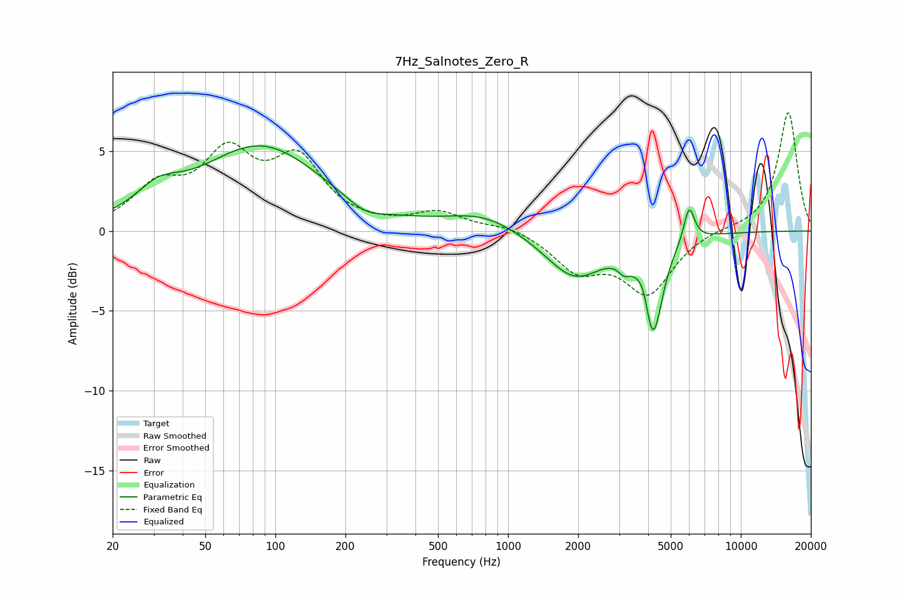

# 7Hz_Salnotes_Zero_R
See [usage instructions](https://github.com/jaakkopasanen/AutoEq#usage) for more options and info.

### Parametric EQs
Apply preamp of -5.4 dB when using parametric equalizer.

|   # | Type    |   Fc (Hz) |    Q |   Gain (dB) |
|-----|---------|-----------|------|-------------|
|   1 | Peaking |        31 | 1.48 |         1.4 |
|   2 | Peaking |        87 | 0.54 |         5.2 |
|   3 | Peaking |       244 | 1.79 |        -0.7 |
|   4 | Peaking |       782 | 0.89 |         1.1 |
|   5 | Peaking |      1900 | 1.54 |        -0.3 |
|   6 | Peaking |      1935 | 1.07 |        -2.7 |
|   7 | Peaking |      3157 | 5.46 |        -0.7 |
|   8 | Peaking |      3834 | 6    |         1.1 |
|   9 | Peaking |      4188 | 3.51 |        -6.1 |
|  10 | Peaking |      5996 | 6    |         2.3 |

### Fixed Band EQs
When using fixed band (also called graphic) equalizer, apply preamp of **-7.5 dB** (if available) and set gains manually with these parameters.

|   # | Type    |   Fc (Hz) |    Q |   Gain (dB) |
|-----|---------|-----------|------|-------------|
|   1 | Peaking |        31 | 1.41 |         2.4 |
|   2 | Peaking |        62 | 1.41 |         4.3 |
|   3 | Peaking |       125 | 1.41 |         4.1 |
|   4 | Peaking |       250 | 1.41 |         0.1 |
|   5 | Peaking |       500 | 1.41 |         1.1 |
|   6 | Peaking |      1000 | 1.41 |         0.4 |
|   7 | Peaking |      2000 | 1.41 |        -2.3 |
|   8 | Peaking |      4000 | 1.41 |        -3.7 |
|   9 | Peaking |      8000 | 1.41 |         0.2 |
|  10 | Peaking |     16000 | 1.41 |         7.5 |

### Graphs

