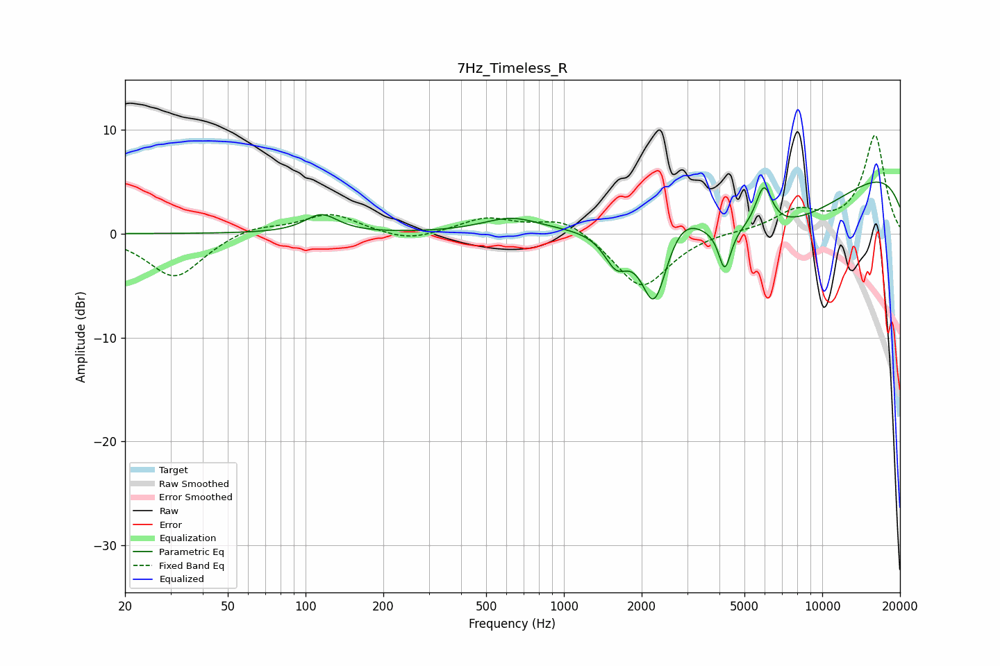

# 7Hz_Timeless_R
See [usage instructions](https://github.com/jaakkopasanen/AutoEq#usage) for more options and info.

### Parametric EQs
Apply preamp of -5.1 dB when using parametric equalizer.

|   # | Type    |   Fc (Hz) |    Q |   Gain (dB) |
|-----|---------|-----------|------|-------------|
|   1 | Peaking |       115 | 2.23 |         1.8 |
|   2 | Peaking |       622 | 1.29 |         1.4 |
|   3 | Peaking |      1594 | 2.95 |        -3.1 |
|   4 | Peaking |      1868 | 1.5  |         0.3 |
|   5 | Peaking |      2236 | 2.73 |        -7.8 |
|   6 | Peaking |      2852 | 1.98 |         2.2 |
|   7 | Peaking |      4194 | 5.95 |        -3.9 |
|   8 | Peaking |      5941 | 4.22 |         4.2 |
|   9 | Peaking |      6179 | 0.38 |        -7   |
|  10 | Peaking |     10000 | 0.18 |         7.9 |

### Fixed Band EQs
When using fixed band (also called graphic) equalizer, apply preamp of **-9.5 dB** (if available) and set gains manually with these parameters.

|   # | Type    |   Fc (Hz) |    Q |   Gain (dB) |
|-----|---------|-----------|------|-------------|
|   1 | Peaking |        31 | 1.41 |        -4.3 |
|   2 | Peaking |        62 | 1.41 |         0.8 |
|   3 | Peaking |       125 | 1.41 |         1.9 |
|   4 | Peaking |       250 | 1.41 |        -0.8 |
|   5 | Peaking |       500 | 1.41 |         1.5 |
|   6 | Peaking |      1000 | 1.41 |         1.7 |
|   7 | Peaking |      2000 | 1.41 |        -5.4 |
|   8 | Peaking |      4000 | 1.41 |         0.2 |
|   9 | Peaking |      8000 | 1.41 |         2.1 |
|  10 | Peaking |     16000 | 1.41 |         9.4 |

### Graphs

