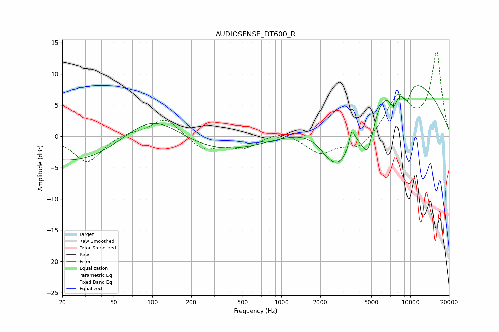

# AUDIOSENSE_DT600_R
See [usage instructions](https://github.com/jaakkopasanen/AutoEq#usage) for more options and info.

### Parametric EQs
Apply preamp of -8.2 dB when using parametric equalizer.

|   # | Type    |   Fc (Hz) |    Q |   Gain (dB) |
|-----|---------|-----------|------|-------------|
|   1 | Peaking |        83 | 0.18 |       -10   |
|   2 | Peaking |        99 | 0.42 |        12   |
|   3 | Peaking |      2380 | 1.61 |        -2.8 |
|   4 | Peaking |      3057 | 1.09 |        -8.4 |
|   5 | Peaking |      3519 | 5.97 |         3.2 |
|   6 | Peaking |      4673 | 2.79 |        -6.8 |
|   7 | Peaking |      7438 | 3.94 |        -3.3 |
|   8 | Peaking |      7462 | 0.28 |        10.6 |
|   9 | Peaking |      8281 | 1.3  |         0.1 |
|  10 | Peaking |      9353 | 3.83 |        -3.2 |

### Fixed Band EQs
When using fixed band (also called graphic) equalizer, apply preamp of **-13.7 dB** (if available) and set gains manually with these parameters.

|   # | Type    |   Fc (Hz) |    Q |   Gain (dB) |
|-----|---------|-----------|------|-------------|
|   1 | Peaking |        31 | 1.41 |        -4.2 |
|   2 | Peaking |        62 | 1.41 |         0.6 |
|   3 | Peaking |       125 | 1.41 |         3.1 |
|   4 | Peaking |       250 | 1.41 |        -2.2 |
|   5 | Peaking |       500 | 1.41 |        -1.8 |
|   6 | Peaking |      1000 | 1.41 |         1   |
|   7 | Peaking |      2000 | 1.41 |        -2.7 |
|   8 | Peaking |      4000 | 1.41 |        -2.1 |
|   9 | Peaking |      8000 | 1.41 |         6.1 |
|  10 | Peaking |     16000 | 1.41 |        13.4 |

### Graphs

