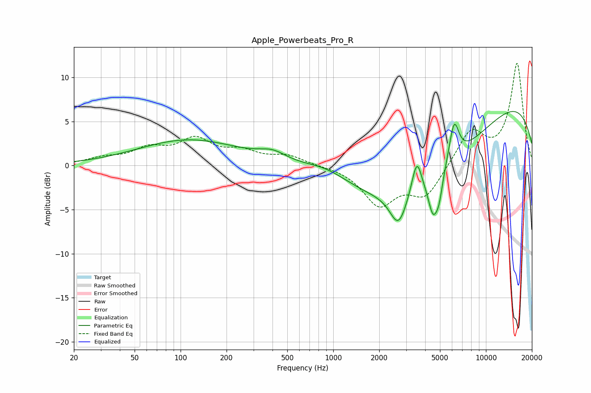

# Apple_Powerbeats_Pro_R
See [usage instructions](https://github.com/jaakkopasanen/AutoEq#usage) for more options and info.

### Parametric EQs
Apply preamp of -6.2 dB when using parametric equalizer.

|   # | Type    |   Fc (Hz) |    Q |   Gain (dB) |
|-----|---------|-----------|------|-------------|
|   1 | Peaking |       114 | 0.42 |         2.9 |
|   2 | Peaking |       401 | 1.53 |         1.1 |
|   3 | Peaking |       902 | 0.91 |         1.4 |
|   4 | Peaking |      2673 | 2.59 |        -3.8 |
|   5 | Peaking |      3526 | 4.42 |         3.9 |
|   6 | Peaking |      4070 | 0.3  |        -8.9 |
|   7 | Peaking |      4512 | 4.3  |        -4.2 |
|   8 | Peaking |      4939 | 5.98 |        -2.1 |
|   9 | Peaking |      6185 | 4.23 |         4.6 |
|  10 | Peaking |     10000 | 0.22 |         9.6 |

### Fixed Band EQs
When using fixed band (also called graphic) equalizer, apply preamp of **-11.7 dB** (if available) and set gains manually with these parameters.

|   # | Type    |   Fc (Hz) |    Q |   Gain (dB) |
|-----|---------|-----------|------|-------------|
|   1 | Peaking |        31 | 1.41 |         0.7 |
|   2 | Peaking |        62 | 1.41 |         1.7 |
|   3 | Peaking |       125 | 1.41 |         2.7 |
|   4 | Peaking |       250 | 1.41 |         1.3 |
|   5 | Peaking |       500 | 1.41 |         1   |
|   6 | Peaking |      1000 | 1.41 |        -0   |
|   7 | Peaking |      2000 | 1.41 |        -4.3 |
|   8 | Peaking |      4000 | 1.41 |        -3.4 |
|   9 | Peaking |      8000 | 1.41 |         3.9 |
|  10 | Peaking |     16000 | 1.41 |        11.5 |

### Graphs

