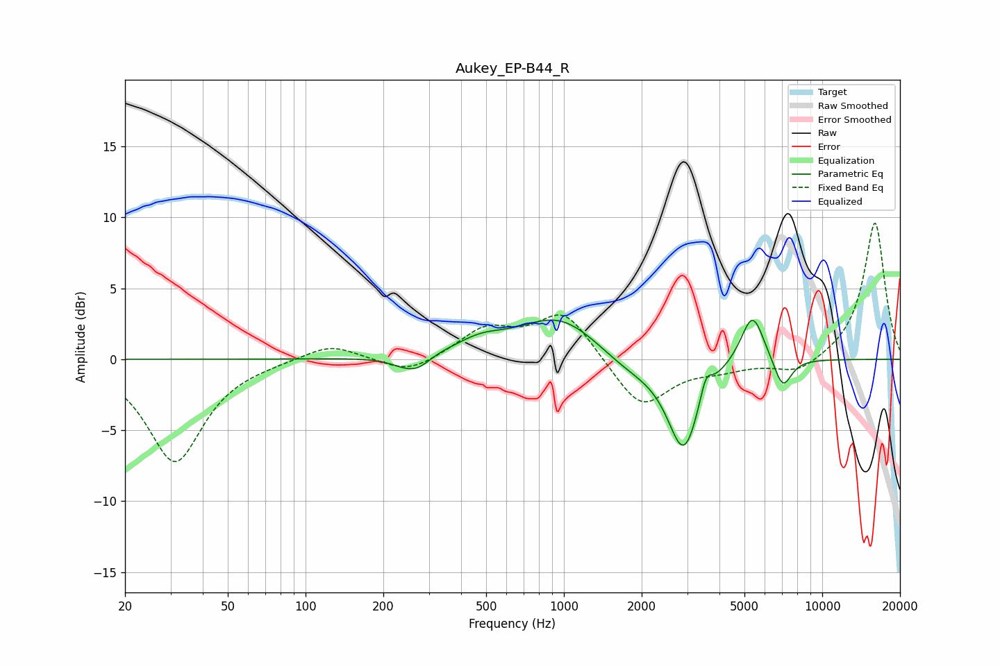

# Aukey_EP-B44_R
See [usage instructions](https://github.com/jaakkopasanen/AutoEq#usage) for more options and info.

### Parametric EQs
Apply preamp of -2.9 dB when using parametric equalizer.

|   # | Type    |   Fc (Hz) |    Q |   Gain (dB) |
|-----|---------|-----------|------|-------------|
|   1 | Peaking |       241 | 2.28 |        -0.6 |
|   2 | Peaking |       274 | 2.6  |        -1.1 |
|   3 | Peaking |       278 | 1.79 |         0.5 |
|   4 | Peaking |       476 | 1.49 |         0.9 |
|   5 | Peaking |       964 | 0.89 |         3.1 |
|   6 | Peaking |      1792 | 1.12 |        -1.2 |
|   7 | Peaking |      2913 | 2.27 |        -6.4 |
|   8 | Peaking |      3542 | 6    |         1.6 |
|   9 | Peaking |      5369 | 3.08 |         3.6 |
|  10 | Peaking |      7030 | 3.91 |        -2.2 |

### Fixed Band EQs
When using fixed band (also called graphic) equalizer, apply preamp of **-9.7 dB** (if available) and set gains manually with these parameters.

|   # | Type    |   Fc (Hz) |    Q |   Gain (dB) |
|-----|---------|-----------|------|-------------|
|   1 | Peaking |        31 | 1.41 |        -7.2 |
|   2 | Peaking |        62 | 1.41 |        -0.1 |
|   3 | Peaking |       125 | 1.41 |         1.1 |
|   4 | Peaking |       250 | 1.41 |        -1.1 |
|   5 | Peaking |       500 | 1.41 |         2   |
|   6 | Peaking |      1000 | 1.41 |         3.4 |
|   7 | Peaking |      2000 | 1.41 |        -3.5 |
|   8 | Peaking |      4000 | 1.41 |        -0.6 |
|   9 | Peaking |      8000 | 1.41 |        -1.1 |
|  10 | Peaking |     16000 | 1.41 |         9.7 |

### Graphs

