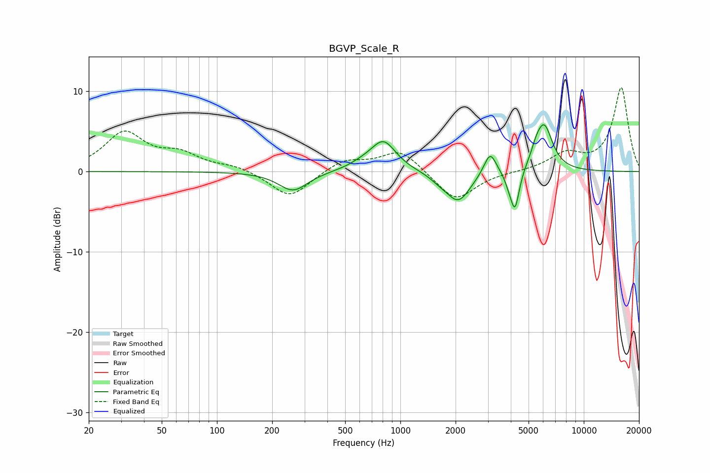

# BGVP_Scale_R
See [usage instructions](https://github.com/jaakkopasanen/AutoEq#usage) for more options and info.

### Parametric EQs
Apply preamp of -5.9 dB when using parametric equalizer.

|   # | Type    |   Fc (Hz) |    Q |   Gain (dB) |
|-----|---------|-----------|------|-------------|
|   1 | Peaking |       260 | 1.78 |        -2.4 |
|   2 | Peaking |       624 | 1.77 |         0.6 |
|   3 | Peaking |       810 | 2.06 |         3.7 |
|   4 | Peaking |      1630 | 2.83 |        -0.6 |
|   5 | Peaking |      2070 | 2.13 |        -3.7 |
|   6 | Peaking |      3085 | 4.21 |         2.9 |
|   7 | Peaking |      3919 | 5.73 |        -1   |
|   8 | Peaking |      4218 | 5.89 |        -4.8 |
|   9 | Peaking |      5500 | 5.12 |         1.1 |
|  10 | Peaking |      6084 | 3.01 |         5.6 |

### Fixed Band EQs
When using fixed band (also called graphic) equalizer, apply preamp of **-10.6 dB** (if available) and set gains manually with these parameters.

|   # | Type    |   Fc (Hz) |    Q |   Gain (dB) |
|-----|---------|-----------|------|-------------|
|   1 | Peaking |        31 | 1.41 |         4.7 |
|   2 | Peaking |        62 | 1.41 |         1.9 |
|   3 | Peaking |       125 | 1.41 |         0.7 |
|   4 | Peaking |       250 | 1.41 |        -3.3 |
|   5 | Peaking |       500 | 1.41 |         1.5 |
|   6 | Peaking |      1000 | 1.41 |         2.8 |
|   7 | Peaking |      2000 | 1.41 |        -3.7 |
|   8 | Peaking |      4000 | 1.41 |        -0   |
|   9 | Peaking |      8000 | 1.41 |         2.1 |
|  10 | Peaking |     16000 | 1.41 |        10.4 |

### Graphs

