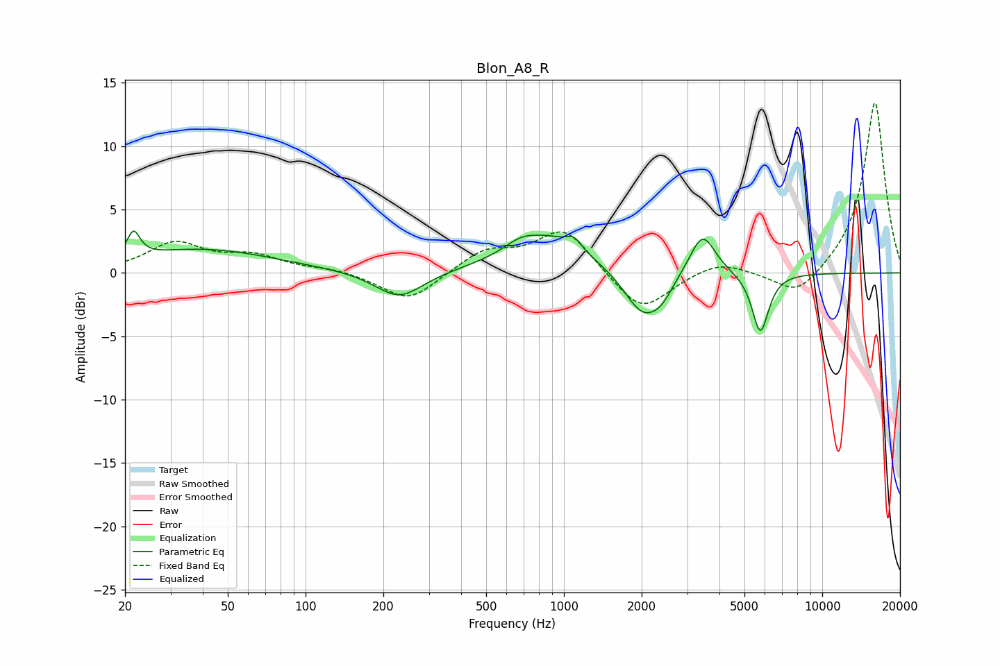

# Blon_A8_R
See [usage instructions](https://github.com/jaakkopasanen/AutoEq#usage) for more options and info.

### Parametric EQs
Apply preamp of -3.4 dB when using parametric equalizer.

|   # | Type    |   Fc (Hz) |    Q |   Gain (dB) |
|-----|---------|-----------|------|-------------|
|   1 | Peaking |        22 | 5.86 |         2   |
|   2 | Peaking |        40 | 0.5  |         1.9 |
|   3 | Peaking |       230 | 1.52 |        -2.2 |
|   4 | Peaking |       677 | 2.44 |         0.6 |
|   5 | Peaking |       875 | 0.91 |         2.9 |
|   6 | Peaking |      1094 | 5.23 |         0.8 |
|   7 | Peaking |      2024 | 1.9  |        -3.6 |
|   8 | Peaking |      2393 | 3.25 |        -1   |
|   9 | Peaking |      3440 | 2.82 |         3.4 |
|  10 | Peaking |      5759 | 4.3  |        -4.8 |

### Fixed Band EQs
When using fixed band (also called graphic) equalizer, apply preamp of **-13.5 dB** (if available) and set gains manually with these parameters.

|   # | Type    |   Fc (Hz) |    Q |   Gain (dB) |
|-----|---------|-----------|------|-------------|
|   1 | Peaking |        31 | 1.41 |         2.3 |
|   2 | Peaking |        62 | 1.41 |         1.2 |
|   3 | Peaking |       125 | 1.41 |         0.3 |
|   4 | Peaking |       250 | 1.41 |        -2.3 |
|   5 | Peaking |       500 | 1.41 |         1.7 |
|   6 | Peaking |      1000 | 1.41 |         3.5 |
|   7 | Peaking |      2000 | 1.41 |        -3.2 |
|   8 | Peaking |      4000 | 1.41 |         1   |
|   9 | Peaking |      8000 | 1.41 |        -2.1 |
|  10 | Peaking |     16000 | 1.41 |        13.6 |

### Graphs

