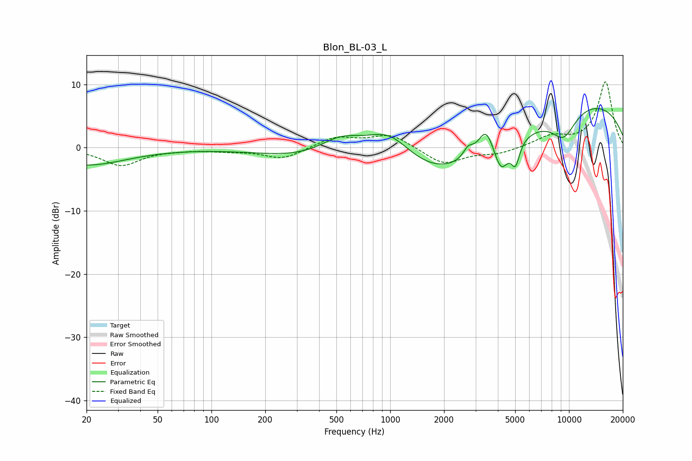

# Blon_BL-03_L
See [usage instructions](https://github.com/jaakkopasanen/AutoEq#usage) for more options and info.

### Parametric EQs
Apply preamp of -6.3 dB when using parametric equalizer.

|   # | Type    |   Fc (Hz) |    Q |   Gain (dB) |
|-----|---------|-----------|------|-------------|
|   1 | Peaking |        20 | 0.64 |        -2.7 |
|   2 | Peaking |       533 | 1.01 |         4.3 |
|   3 | Peaking |       985 | 0.87 |         8.3 |
|   4 | Peaking |      1643 | 0.28 |       -11.4 |
|   5 | Peaking |      2729 | 5.05 |         1.6 |
|   6 | Peaking |      3431 | 3.21 |         4.3 |
|   7 | Peaking |      4166 | 3.54 |        -4.4 |
|   8 | Peaking |      5019 | 6    |        -3.6 |
|   9 | Peaking |      8246 | 0.19 |         8.8 |
|  10 | Peaking |      9347 | 1.82 |        -4.2 |

### Fixed Band EQs
When using fixed band (also called graphic) equalizer, apply preamp of **-10.5 dB** (if available) and set gains manually with these parameters.

|   # | Type    |   Fc (Hz) |    Q |   Gain (dB) |
|-----|---------|-----------|------|-------------|
|   1 | Peaking |        31 | 1.41 |        -2.8 |
|   2 | Peaking |        62 | 1.41 |        -0.2 |
|   3 | Peaking |       125 | 1.41 |        -0.4 |
|   4 | Peaking |       250 | 1.41 |        -1.8 |
|   5 | Peaking |       500 | 1.41 |         1.7 |
|   6 | Peaking |      1000 | 1.41 |         2.1 |
|   7 | Peaking |      2000 | 1.41 |        -2.7 |
|   8 | Peaking |      4000 | 1.41 |        -0.9 |
|   9 | Peaking |      8000 | 1.41 |         1.7 |
|  10 | Peaking |     16000 | 1.41 |        10.4 |

### Graphs

