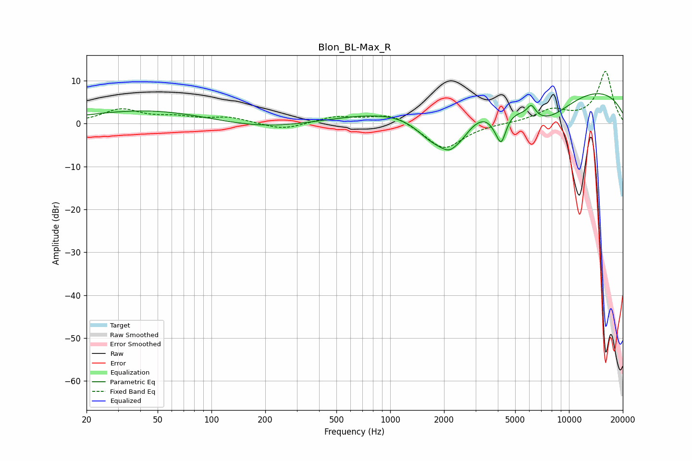

# Blon_BL-Max_R
See [usage instructions](https://github.com/jaakkopasanen/AutoEq#usage) for more options and info.

### Parametric EQs
Apply preamp of -7.1 dB when using parametric equalizer.

|   # | Type    |   Fc (Hz) |    Q |   Gain (dB) |
|-----|---------|-----------|------|-------------|
|   1 | Peaking |       164 | 0.18 |         9.7 |
|   2 | Peaking |       199 | 0.3  |       -10   |
|   3 | Peaking |      1691 | 1.41 |        -5.1 |
|   4 | Peaking |      2258 | 1.8  |       -10.3 |
|   5 | Peaking |      2298 | 4.2  |         1.6 |
|   6 | Peaking |      3880 | 3.65 |        -1.8 |
|   7 | Peaking |      4185 | 4.94 |        -6.5 |
|   8 | Peaking |      6158 | 5.9  |         2.6 |
|   9 | Peaking |      7368 | 0.79 |        -8.3 |
|  10 | Peaking |      8130 | 0.18 |        10.4 |

### Fixed Band EQs
When using fixed band (also called graphic) equalizer, apply preamp of **-12.3 dB** (if available) and set gains manually with these parameters.

|   # | Type    |   Fc (Hz) |    Q |   Gain (dB) |
|-----|---------|-----------|------|-------------|
|   1 | Peaking |        31 | 1.41 |         3.2 |
|   2 | Peaking |        62 | 1.41 |         1.3 |
|   3 | Peaking |       125 | 1.41 |         1.4 |
|   4 | Peaking |       250 | 1.41 |        -1.5 |
|   5 | Peaking |       500 | 1.41 |         1.6 |
|   6 | Peaking |      1000 | 1.41 |         2.5 |
|   7 | Peaking |      2000 | 1.41 |        -6.1 |
|   8 | Peaking |      4000 | 1.41 |         0.1 |
|   9 | Peaking |      8000 | 1.41 |         2.9 |
|  10 | Peaking |     16000 | 1.41 |        12.1 |

### Graphs

