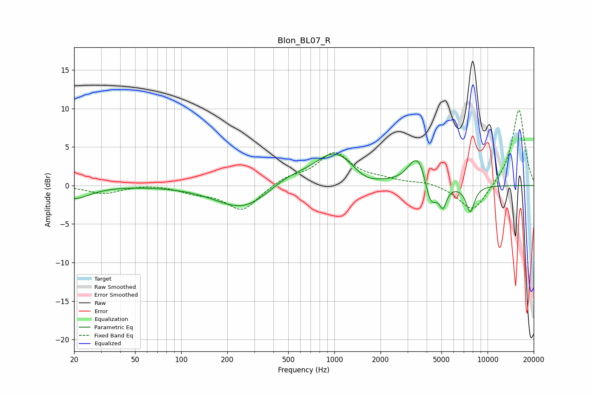

# Blon_BL07_R
See [usage instructions](https://github.com/jaakkopasanen/AutoEq#usage) for more options and info.

### Parametric EQs
Apply preamp of -4.2 dB when using parametric equalizer.

|   # | Type    |   Fc (Hz) |    Q |   Gain (dB) |
|-----|---------|-----------|------|-------------|
|   1 | Peaking |        20 | 1.41 |        -1.7 |
|   2 | Peaking |       253 | 0.81 |        -3.2 |
|   3 | Peaking |       497 | 1.11 |         1.3 |
|   4 | Peaking |      1007 | 1.08 |         4.3 |
|   5 | Peaking |      1607 | 1.77 |        -1   |
|   6 | Peaking |      3295 | 2.67 |         1.8 |
|   7 | Peaking |      3642 | 2.88 |         2.7 |
|   8 | Peaking |      4244 | 3.53 |        -3.6 |
|   9 | Peaking |      5114 | 5.84 |        -2.5 |
|  10 | Peaking |      7711 | 4.71 |        -3.4 |

### Fixed Band EQs
When using fixed band (also called graphic) equalizer, apply preamp of **-9.9 dB** (if available) and set gains manually with these parameters.

|   # | Type    |   Fc (Hz) |    Q |   Gain (dB) |
|-----|---------|-----------|------|-------------|
|   1 | Peaking |        31 | 1.41 |        -1   |
|   2 | Peaking |        62 | 1.41 |         0.2 |
|   3 | Peaking |       125 | 1.41 |        -0.8 |
|   4 | Peaking |       250 | 1.41 |        -3.3 |
|   5 | Peaking |       500 | 1.41 |         1   |
|   6 | Peaking |      1000 | 1.41 |         4.1 |
|   7 | Peaking |      2000 | 1.41 |         0.6 |
|   8 | Peaking |      4000 | 1.41 |         0.5 |
|   9 | Peaking |      8000 | 1.41 |        -3.6 |
|  10 | Peaking |     16000 | 1.41 |        10   |

### Graphs

