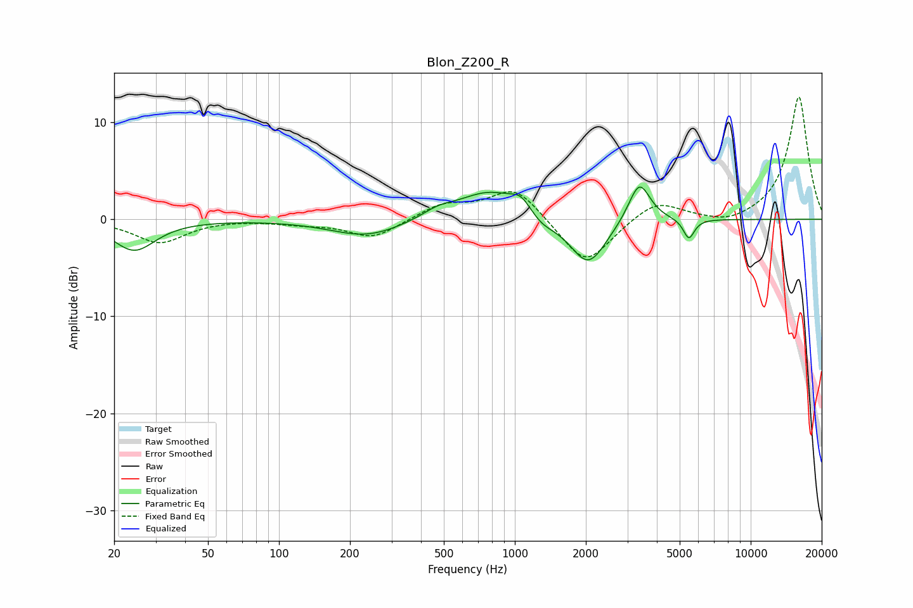

# Blon_Z200_R
See [usage instructions](https://github.com/jaakkopasanen/AutoEq#usage) for more options and info.

### Parametric EQs
Apply preamp of -3.4 dB when using parametric equalizer.

|   # | Type    |   Fc (Hz) |    Q |   Gain (dB) |
|-----|---------|-----------|------|-------------|
|   1 | Peaking |        24 | 1.6  |        -3.2 |
|   2 | Peaking |       237 | 0.92 |        -1.8 |
|   3 | Peaking |       472 | 2.09 |         0.8 |
|   4 | Peaking |       784 | 1.04 |         3   |
|   5 | Peaking |      1063 | 3.3  |         1.3 |
|   6 | Peaking |      1344 | 2.36 |        -1.5 |
|   7 | Peaking |      1407 | 2.8  |         0.6 |
|   8 | Peaking |      2049 | 1.83 |        -4.9 |
|   9 | Peaking |      3370 | 3.06 |         4.3 |
|  10 | Peaking |      5468 | 6    |        -2.1 |

### Fixed Band EQs
When using fixed band (also called graphic) equalizer, apply preamp of **-12.7 dB** (if available) and set gains manually with these parameters.

|   # | Type    |   Fc (Hz) |    Q |   Gain (dB) |
|-----|---------|-----------|------|-------------|
|   1 | Peaking |        31 | 1.41 |        -2.4 |
|   2 | Peaking |        62 | 1.41 |         0.1 |
|   3 | Peaking |       125 | 1.41 |        -0.4 |
|   4 | Peaking |       250 | 1.41 |        -1.9 |
|   5 | Peaking |       500 | 1.41 |         1.5 |
|   6 | Peaking |      1000 | 1.41 |         3.4 |
|   7 | Peaking |      2000 | 1.41 |        -4.9 |
|   8 | Peaking |      4000 | 1.41 |         2.1 |
|   9 | Peaking |      8000 | 1.41 |        -0.7 |
|  10 | Peaking |     16000 | 1.41 |        12.7 |

### Graphs

