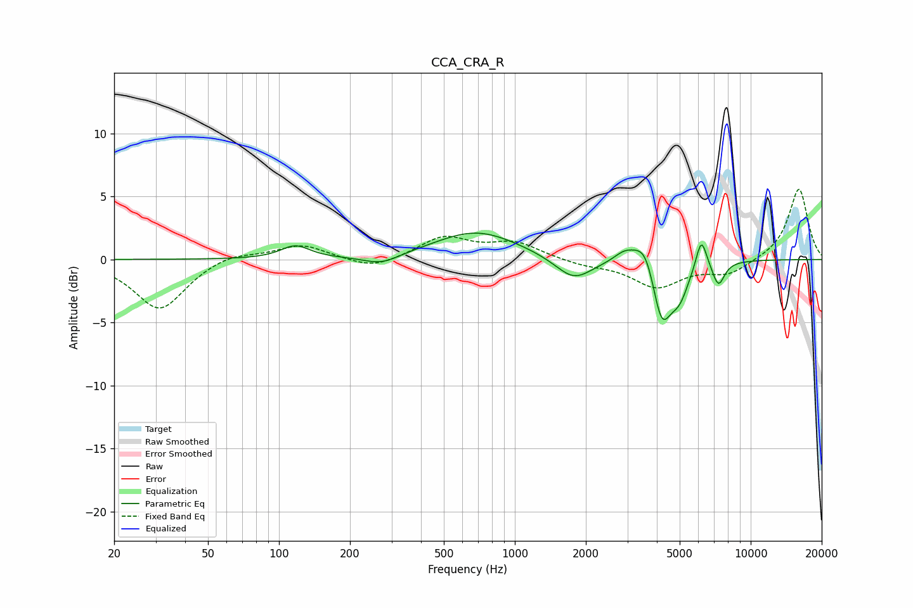

# CCA_CRA_R
See [usage instructions](https://github.com/jaakkopasanen/AutoEq#usage) for more options and info.

### Parametric EQs
Apply preamp of -2.2 dB when using parametric equalizer.

|   # | Type    |   Fc (Hz) |    Q |   Gain (dB) |
|-----|---------|-----------|------|-------------|
|   1 | Peaking |       117 | 2.3  |         1   |
|   2 | Peaking |       272 | 1.79 |        -0.8 |
|   3 | Peaking |       689 | 0.79 |         2.2 |
|   4 | Peaking |      1779 | 1.78 |        -1.9 |
|   5 | Peaking |      2921 | 3.18 |         0.8 |
|   6 | Peaking |      3592 | 2.9  |         2.4 |
|   7 | Peaking |      4186 | 3.35 |        -5.1 |
|   8 | Peaking |      4990 | 3.42 |        -2.3 |
|   9 | Peaking |      6177 | 5.98 |         2.5 |
|  10 | Peaking |      7299 | 5.23 |        -1.9 |

### Fixed Band EQs
When using fixed band (also called graphic) equalizer, apply preamp of **-5.7 dB** (if available) and set gains manually with these parameters.

|   # | Type    |   Fc (Hz) |    Q |   Gain (dB) |
|-----|---------|-----------|------|-------------|
|   1 | Peaking |        31 | 1.41 |        -4   |
|   2 | Peaking |        62 | 1.41 |         0.6 |
|   3 | Peaking |       125 | 1.41 |         1.2 |
|   4 | Peaking |       250 | 1.41 |        -0.8 |
|   5 | Peaking |       500 | 1.41 |         1.7 |
|   6 | Peaking |      1000 | 1.41 |         1.3 |
|   7 | Peaking |      2000 | 1.41 |        -0.4 |
|   8 | Peaking |      4000 | 1.41 |        -2.1 |
|   9 | Peaking |      8000 | 1.41 |        -1.1 |
|  10 | Peaking |     16000 | 1.41 |         5.7 |

### Graphs

