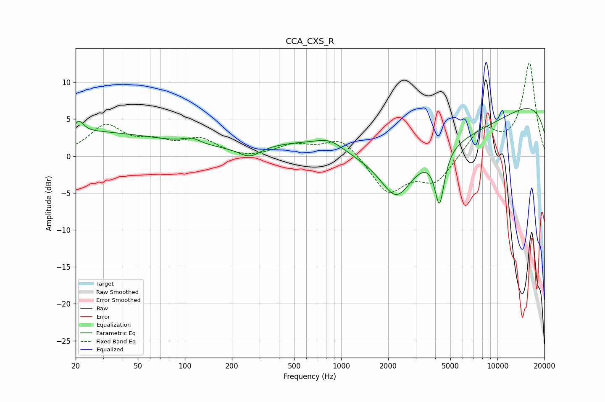

# CCA_CXS_R
See [usage instructions](https://github.com/jaakkopasanen/AutoEq#usage) for more options and info.

### Parametric EQs
Apply preamp of -6.5 dB when using parametric equalizer.

|   # | Type    |   Fc (Hz) |    Q |   Gain (dB) |
|-----|---------|-----------|------|-------------|
|   1 | Peaking |        20 | 0.22 |         3.3 |
|   2 | Peaking |        21 | 5.15 |         1.4 |
|   3 | Peaking |       111 | 2.46 |         0.8 |
|   4 | Peaking |       260 | 2.03 |        -1.5 |
|   5 | Peaking |       766 | 0.42 |         4.8 |
|   6 | Peaking |       844 | 1.63 |         1.2 |
|   7 | Peaking |      2259 | 1.43 |        -5.6 |
|   8 | Peaking |      3064 | 0.18 |        -6.8 |
|   9 | Peaking |      4260 | 4.62 |        -7.2 |
|  10 | Peaking |     10000 | 0.18 |         9.5 |

### Fixed Band EQs
When using fixed band (also called graphic) equalizer, apply preamp of **-12.7 dB** (if available) and set gains manually with these parameters.

|   # | Type    |   Fc (Hz) |    Q |   Gain (dB) |
|-----|---------|-----------|------|-------------|
|   1 | Peaking |        31 | 1.41 |         3.9 |
|   2 | Peaking |        62 | 1.41 |         1.5 |
|   3 | Peaking |       125 | 1.41 |         2.1 |
|   4 | Peaking |       250 | 1.41 |        -0.4 |
|   5 | Peaking |       500 | 1.41 |         1.4 |
|   6 | Peaking |      1000 | 1.41 |         2.6 |
|   7 | Peaking |      2000 | 1.41 |        -4.9 |
|   8 | Peaking |      4000 | 1.41 |        -3.5 |
|   9 | Peaking |      8000 | 1.41 |         3.7 |
|  10 | Peaking |     16000 | 1.41 |        12.5 |

### Graphs

