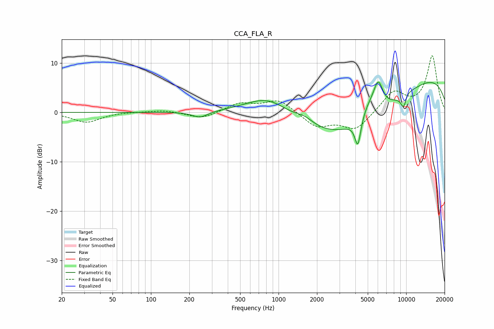

# CCA_FLA_R
See [usage instructions](https://github.com/jaakkopasanen/AutoEq#usage) for more options and info.

### Parametric EQs
Apply preamp of -6.2 dB when using parametric equalizer.

|   # | Type    |   Fc (Hz) |    Q |   Gain (dB) |
|-----|---------|-----------|------|-------------|
|   1 | Peaking |       242 | 2.37 |        -1.2 |
|   2 | Peaking |       840 | 0.76 |         4.9 |
|   3 | Peaking |      1599 | 1.96 |         1.4 |
|   4 | Peaking |      4046 | 0.3  |       -11.3 |
|   5 | Peaking |      4182 | 6    |        -5.7 |
|   6 | Peaking |      5092 | 1.79 |         3.1 |
|   7 | Peaking |      6042 | 3.69 |         5.2 |
|   8 | Peaking |      9562 | 5.13 |        -3.5 |
|   9 | Peaking |      9861 | 3.41 |         1.2 |
|  10 | Peaking |     10000 | 0.22 |        10.2 |

### Fixed Band EQs
When using fixed band (also called graphic) equalizer, apply preamp of **-11.6 dB** (if available) and set gains manually with these parameters.

|   # | Type    |   Fc (Hz) |    Q |   Gain (dB) |
|-----|---------|-----------|------|-------------|
|   1 | Peaking |        31 | 1.41 |        -2   |
|   2 | Peaking |        62 | 1.41 |         0.1 |
|   3 | Peaking |       125 | 1.41 |         0.5 |
|   4 | Peaking |       250 | 1.41 |        -1.3 |
|   5 | Peaking |       500 | 1.41 |         1.8 |
|   6 | Peaking |      1000 | 1.41 |         2.6 |
|   7 | Peaking |      2000 | 1.41 |        -2.9 |
|   8 | Peaking |      4000 | 1.41 |        -3.5 |
|   9 | Peaking |      8000 | 1.41 |         4.1 |
|  10 | Peaking |     16000 | 1.41 |        11.4 |

### Graphs

