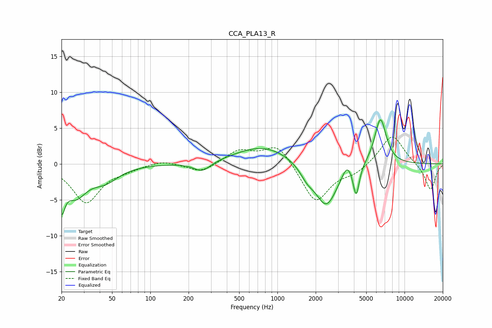

# CCA_PLA13_R
See [usage instructions](https://github.com/jaakkopasanen/AutoEq#usage) for more options and info.

### Parametric EQs
Apply preamp of -6.2 dB when using parametric equalizer.

|   # | Type    |   Fc (Hz) |    Q |   Gain (dB) |
|-----|---------|-----------|------|-------------|
|   1 | Peaking |        20 | 5.57 |        -4.4 |
|   2 | Peaking |        26 | 1.61 |        -4   |
|   3 | Peaking |        44 | 1.33 |        -2   |
|   4 | Peaking |       256 | 2.06 |        -1.4 |
|   5 | Peaking |       781 | 0.64 |         2.5 |
|   6 | Peaking |      1711 | 2.52 |        -1.4 |
|   7 | Peaking |      2423 | 1.6  |        -6   |
|   8 | Peaking |      3535 | 3.7  |         1.8 |
|   9 | Peaking |      4164 | 5.85 |        -4.3 |
|  10 | Peaking |      6460 | 2.96 |         6.5 |

### Fixed Band EQs
When using fixed band (also called graphic) equalizer, apply preamp of **-3.8 dB** (if available) and set gains manually with these parameters.

|   # | Type    |   Fc (Hz) |    Q |   Gain (dB) |
|-----|---------|-----------|------|-------------|
|   1 | Peaking |        31 | 1.41 |        -5.3 |
|   2 | Peaking |        62 | 1.41 |        -0.6 |
|   3 | Peaking |       125 | 1.41 |         0.6 |
|   4 | Peaking |       250 | 1.41 |        -1.3 |
|   5 | Peaking |       500 | 1.41 |         1.9 |
|   6 | Peaking |      1000 | 1.41 |         2.8 |
|   7 | Peaking |      2000 | 1.41 |        -5.4 |
|   8 | Peaking |      4000 | 1.41 |        -1.2 |
|   9 | Peaking |      8000 | 1.41 |         4.2 |
|  10 | Peaking |     16000 | 1.41 |        -3.7 |

### Graphs

