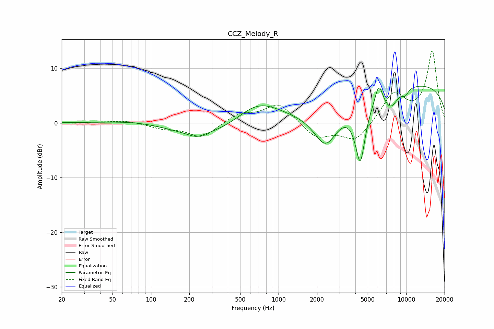

# CCZ_Melody_R
See [usage instructions](https://github.com/jaakkopasanen/AutoEq#usage) for more options and info.

### Parametric EQs
Apply preamp of -6.8 dB when using parametric equalizer.

|   # | Type    |   Fc (Hz) |    Q |   Gain (dB) |
|-----|---------|-----------|------|-------------|
|   1 | Peaking |        97 | 0.54 |         1.2 |
|   2 | Peaking |       228 | 2.32 |        -0.8 |
|   3 | Peaking |       340 | 0.33 |        -3.7 |
|   4 | Peaking |       687 | 0.74 |         5.6 |
|   5 | Peaking |      2344 | 1.44 |        -7.3 |
|   6 | Peaking |      4368 | 3.34 |       -11.5 |
|   7 | Peaking |      6108 | 4.67 |         3.6 |
|   8 | Peaking |      7529 | 2.27 |        -3.5 |
|   9 | Peaking |      9823 | 4.82 |        -1.1 |
|  10 | Peaking |     10000 | 0.18 |         7.3 |

### Fixed Band EQs
When using fixed band (also called graphic) equalizer, apply preamp of **-13.3 dB** (if available) and set gains manually with these parameters.

|   # | Type    |   Fc (Hz) |    Q |   Gain (dB) |
|-----|---------|-----------|------|-------------|
|   1 | Peaking |        31 | 1.41 |         0.1 |
|   2 | Peaking |        62 | 1.41 |         0.5 |
|   3 | Peaking |       125 | 1.41 |        -0.9 |
|   4 | Peaking |       250 | 1.41 |        -2.7 |
|   5 | Peaking |       500 | 1.41 |         1.7 |
|   6 | Peaking |      1000 | 1.41 |         3.6 |
|   7 | Peaking |      2000 | 1.41 |        -2.8 |
|   8 | Peaking |      4000 | 1.41 |        -3.4 |
|   9 | Peaking |      8000 | 1.41 |         5.3 |
|  10 | Peaking |     16000 | 1.41 |        13.1 |

### Graphs

