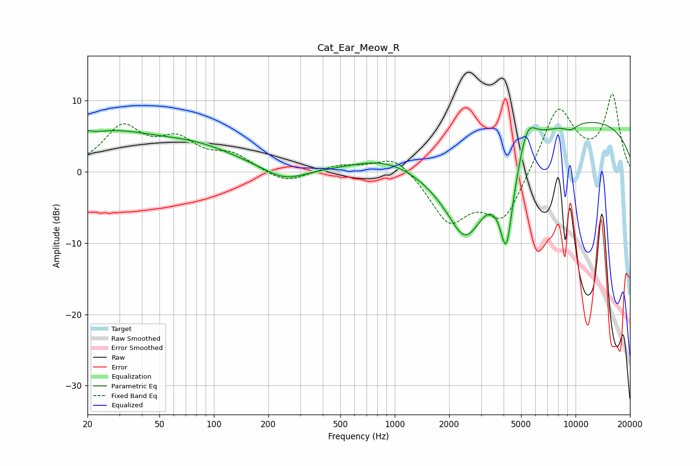

# Cat_Ear_Meow_R
See [usage instructions](https://github.com/jaakkopasanen/AutoEq#usage) for more options and info.

### Parametric EQs
Apply preamp of -7.0 dB when using parametric equalizer.

|   # | Type    |   Fc (Hz) |    Q |   Gain (dB) |
|-----|---------|-----------|------|-------------|
|   1 | Peaking |        20 | 5.93 |         0.6 |
|   2 | Peaking |        25 | 0.51 |         5   |
|   3 | Peaking |        82 | 0.6  |         2.7 |
|   4 | Peaking |       245 | 1.24 |        -1.9 |
|   5 | Peaking |       889 | 0.77 |         2   |
|   6 | Peaking |      2470 | 1.12 |       -12.5 |
|   7 | Peaking |      4145 | 3.55 |       -12.1 |
|   8 | Peaking |      5422 | 2.94 |         4.1 |
|   9 | Peaking |      9390 | 3.34 |        -0.9 |
|  10 | Peaking |      9837 | 0.21 |         7.5 |

### Fixed Band EQs
When using fixed band (also called graphic) equalizer, apply preamp of **-11.0 dB** (if available) and set gains manually with these parameters.

|   # | Type    |   Fc (Hz) |    Q |   Gain (dB) |
|-----|---------|-----------|------|-------------|
|   1 | Peaking |        31 | 1.41 |         5.9 |
|   2 | Peaking |        62 | 1.41 |         3.8 |
|   3 | Peaking |       125 | 1.41 |         2.1 |
|   4 | Peaking |       250 | 1.41 |        -1.7 |
|   5 | Peaking |       500 | 1.41 |         0.9 |
|   6 | Peaking |      1000 | 1.41 |         2.6 |
|   7 | Peaking |      2000 | 1.41 |        -6.8 |
|   8 | Peaking |      4000 | 1.41 |        -6.8 |
|   9 | Peaking |      8000 | 1.41 |         9.3 |
|  10 | Peaking |     16000 | 1.41 |        10.5 |

### Graphs

