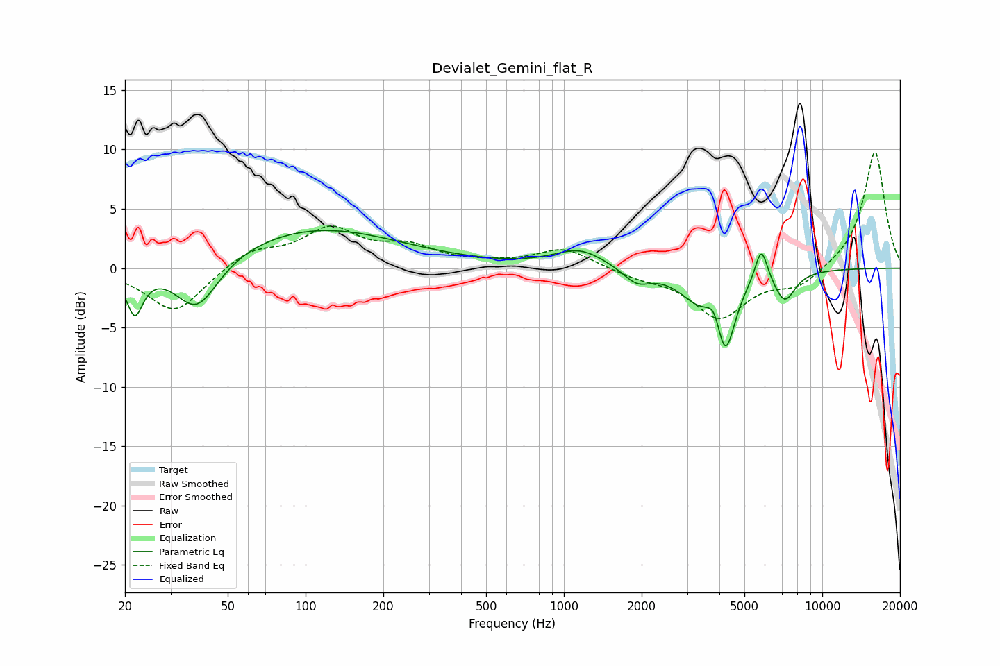

# Devialet_Gemini_flat_R
See [usage instructions](https://github.com/jaakkopasanen/AutoEq#usage) for more options and info.

### Parametric EQs
Apply preamp of -3.3 dB when using parametric equalizer.

|   # | Type    |   Fc (Hz) |    Q |   Gain (dB) |
|-----|---------|-----------|------|-------------|
|   1 | Peaking |        22 | 4.49 |        -3.7 |
|   2 | Peaking |        38 | 1.68 |        -4.4 |
|   3 | Peaking |       110 | 0.43 |         3.4 |
|   4 | Peaking |      1153 | 1.42 |         1.6 |
|   5 | Peaking |      1915 | 2.61 |        -1.3 |
|   6 | Peaking |      3285 | 1.86 |        -2.1 |
|   7 | Peaking |      3843 | 5.04 |         1.9 |
|   8 | Peaking |      4204 | 3.6  |        -6.5 |
|   9 | Peaking |      5810 | 5.68 |         3   |
|  10 | Peaking |      7160 | 3.33 |        -2.5 |

### Fixed Band EQs
When using fixed band (also called graphic) equalizer, apply preamp of **-9.9 dB** (if available) and set gains manually with these parameters.

|   # | Type    |   Fc (Hz) |    Q |   Gain (dB) |
|-----|---------|-----------|------|-------------|
|   1 | Peaking |        31 | 1.41 |        -3.8 |
|   2 | Peaking |        62 | 1.41 |         1.5 |
|   3 | Peaking |       125 | 1.41 |         3.1 |
|   4 | Peaking |       250 | 1.41 |         1.6 |
|   5 | Peaking |       500 | 1.41 |         0.3 |
|   6 | Peaking |      1000 | 1.41 |         1.7 |
|   7 | Peaking |      2000 | 1.41 |        -0.7 |
|   8 | Peaking |      4000 | 1.41 |        -4.1 |
|   9 | Peaking |      8000 | 1.41 |        -1.5 |
|  10 | Peaking |     16000 | 1.41 |         9.9 |

### Graphs

