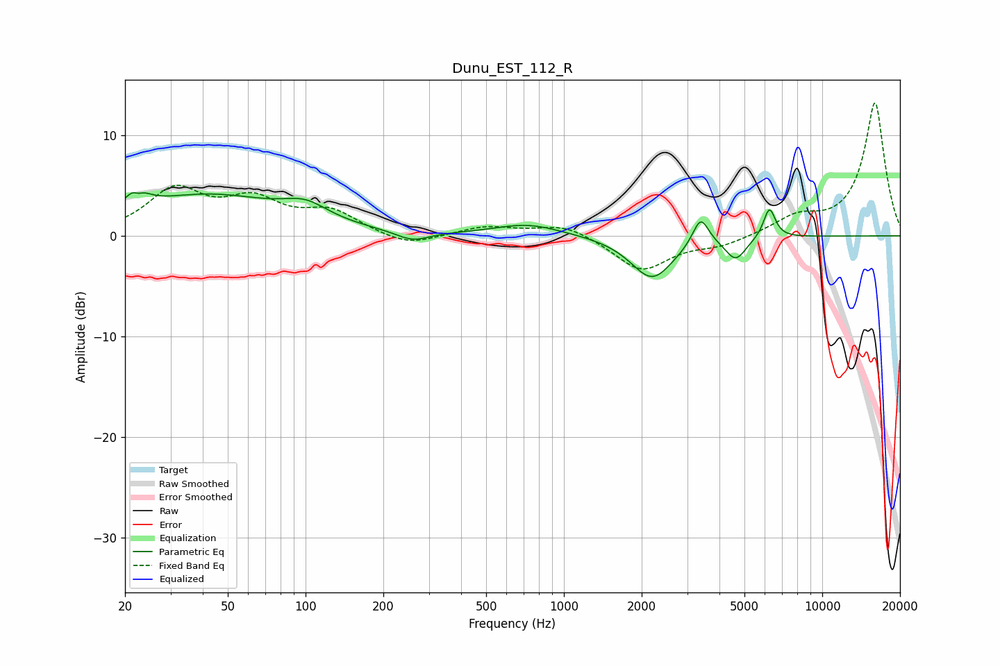

# Dunu_EST_112_R
See [usage instructions](https://github.com/jaakkopasanen/AutoEq#usage) for more options and info.

### Parametric EQs
Apply preamp of -4.4 dB when using parametric equalizer.

|   # | Type    |   Fc (Hz) |    Q |   Gain (dB) |
|-----|---------|-----------|------|-------------|
|   1 | Peaking |        22 | 4.36 |         4.2 |
|   2 | Peaking |        22 | 5.7  |        -2.8 |
|   3 | Peaking |        41 | 0.48 |         4   |
|   4 | Peaking |       100 | 1.65 |         1.5 |
|   5 | Peaking |       260 | 2.18 |        -1   |
|   6 | Peaking |       725 | 1.08 |         1.2 |
|   7 | Peaking |      2196 | 1.72 |        -4.3 |
|   8 | Peaking |      3383 | 4.5  |         2.9 |
|   9 | Peaking |      4627 | 3.51 |        -2.2 |
|  10 | Peaking |      6245 | 5.96 |         3   |

### Fixed Band EQs
When using fixed band (also called graphic) equalizer, apply preamp of **-13.3 dB** (if available) and set gains manually with these parameters.

|   # | Type    |   Fc (Hz) |    Q |   Gain (dB) |
|-----|---------|-----------|------|-------------|
|   1 | Peaking |        31 | 1.41 |         4.4 |
|   2 | Peaking |        62 | 1.41 |         3.1 |
|   3 | Peaking |       125 | 1.41 |         2.2 |
|   4 | Peaking |       250 | 1.41 |        -1.2 |
|   5 | Peaking |       500 | 1.41 |         0.9 |
|   6 | Peaking |      1000 | 1.41 |         1.2 |
|   7 | Peaking |      2000 | 1.41 |        -3.5 |
|   8 | Peaking |      4000 | 1.41 |        -0.9 |
|   9 | Peaking |      8000 | 1.41 |         1.7 |
|  10 | Peaking |     16000 | 1.41 |        13.2 |

### Graphs

