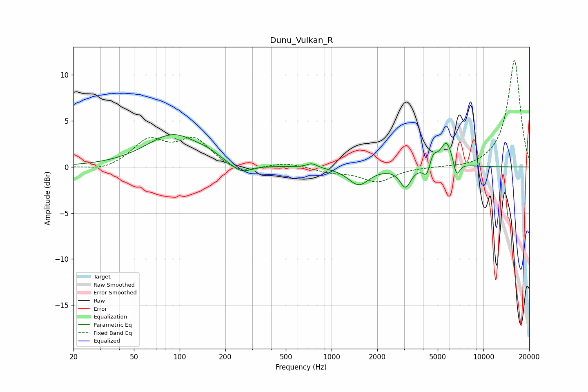

# Dunu_Vulkan_R
See [usage instructions](https://github.com/jaakkopasanen/AutoEq#usage) for more options and info.

### Parametric EQs
Apply preamp of -3.6 dB when using parametric equalizer.

|   # | Type    |   Fc (Hz) |    Q |   Gain (dB) |
|-----|---------|-----------|------|-------------|
|   1 | Peaking |        91 | 0.8  |         3.5 |
|   2 | Peaking |       153 | 2.12 |         0.4 |
|   3 | Peaking |       254 | 1.96 |        -1.2 |
|   4 | Peaking |       742 | 4.28 |         0.5 |
|   5 | Peaking |      1508 | 2.08 |        -1.9 |
|   6 | Peaking |      3064 | 3.97 |        -2.1 |
|   7 | Peaking |      4230 | 6    |        -1.3 |
|   8 | Peaking |      4666 | 5.97 |         1.2 |
|   9 | Peaking |      5727 | 3.27 |         2.9 |
|  10 | Peaking |      6641 | 6    |        -1.9 |

### Fixed Band EQs
When using fixed band (also called graphic) equalizer, apply preamp of **-11.6 dB** (if available) and set gains manually with these parameters.

|   # | Type    |   Fc (Hz) |    Q |   Gain (dB) |
|-----|---------|-----------|------|-------------|
|   1 | Peaking |        31 | 1.41 |        -0.5 |
|   2 | Peaking |        62 | 1.41 |         2.8 |
|   3 | Peaking |       125 | 1.41 |         2.8 |
|   4 | Peaking |       250 | 1.41 |        -0.9 |
|   5 | Peaking |       500 | 1.41 |         0.5 |
|   6 | Peaking |      1000 | 1.41 |        -0.5 |
|   7 | Peaking |      2000 | 1.41 |        -1.6 |
|   8 | Peaking |      4000 | 1.41 |        -0   |
|   9 | Peaking |      8000 | 1.41 |        -0.2 |
|  10 | Peaking |     16000 | 1.41 |        11.6 |

### Graphs

