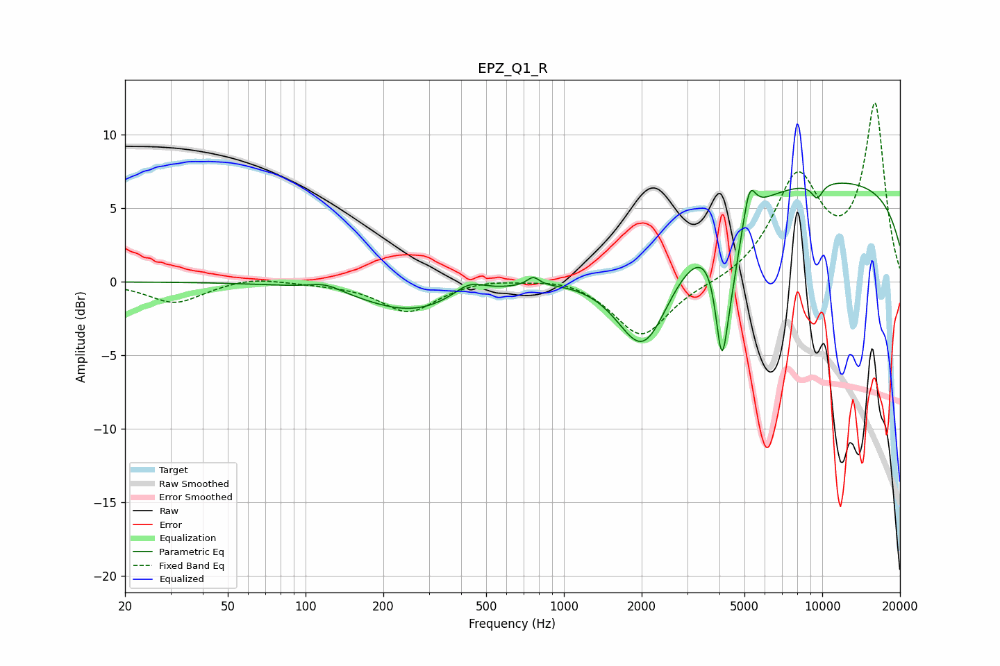

# EPZ_Q1_R
See [usage instructions](https://github.com/jaakkopasanen/AutoEq#usage) for more options and info.

### Parametric EQs
Apply preamp of -6.8 dB when using parametric equalizer.

|   # | Type    |   Fc (Hz) |    Q |   Gain (dB) |
|-----|---------|-----------|------|-------------|
|   1 | Peaking |       120 | 2.17 |         0.5 |
|   2 | Peaking |       258 | 0.73 |        -2   |
|   3 | Peaking |       429 | 2.33 |         0.9 |
|   4 | Peaking |       760 | 5.99 |         0.6 |
|   5 | Peaking |      2038 | 1.29 |        -7.1 |
|   6 | Peaking |      4087 | 5.76 |        -7.1 |
|   7 | Peaking |      4445 | 3.64 |        -2.9 |
|   8 | Peaking |      5230 | 6    |         2.4 |
|   9 | Peaking |      9555 | 5.63 |        -1   |
|  10 | Peaking |     10000 | 0.18 |         7   |

### Fixed Band EQs
When using fixed band (also called graphic) equalizer, apply preamp of **-12.2 dB** (if available) and set gains manually with these parameters.

|   # | Type    |   Fc (Hz) |    Q |   Gain (dB) |
|-----|---------|-----------|------|-------------|
|   1 | Peaking |        31 | 1.41 |        -1.4 |
|   2 | Peaking |        62 | 1.41 |         0.4 |
|   3 | Peaking |       125 | 1.41 |        -0.1 |
|   4 | Peaking |       250 | 1.41 |        -2   |
|   5 | Peaking |       500 | 1.41 |         0.3 |
|   6 | Peaking |      1000 | 1.41 |         0.4 |
|   7 | Peaking |      2000 | 1.41 |        -3.8 |
|   8 | Peaking |      4000 | 1.41 |        -0.2 |
|   9 | Peaking |      8000 | 1.41 |         6.8 |
|  10 | Peaking |     16000 | 1.41 |        11.9 |

### Graphs

