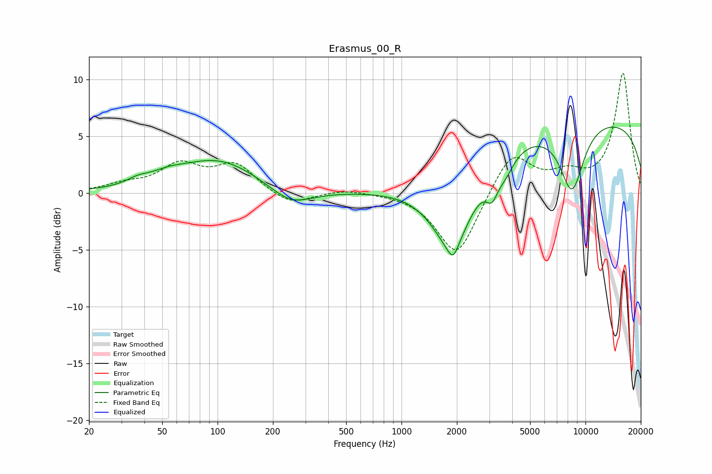

# Erasmus_00_R
See [usage instructions](https://github.com/jaakkopasanen/AutoEq#usage) for more options and info.

### Parametric EQs
Apply preamp of -5.9 dB when using parametric equalizer.

|   # | Type    |   Fc (Hz) |    Q |   Gain (dB) |
|-----|---------|-----------|------|-------------|
|   1 | Peaking |        37 | 2.42 |         0.4 |
|   2 | Peaking |        53 | 1.48 |         0.6 |
|   3 | Peaking |       101 | 0.65 |         2.9 |
|   4 | Peaking |       250 | 1.22 |        -1.6 |
|   5 | Peaking |      1893 | 1.23 |        -7   |
|   6 | Peaking |      1906 | 5.15 |        -1.2 |
|   7 | Peaking |      3108 | 4.22 |        -2   |
|   8 | Peaking |      3680 | 3.01 |        -1.3 |
|   9 | Peaking |      8443 | 1.97 |        -6   |
|  10 | Peaking |      9969 | 0.18 |         6.7 |

### Fixed Band EQs
When using fixed band (also called graphic) equalizer, apply preamp of **-10.6 dB** (if available) and set gains manually with these parameters.

|   # | Type    |   Fc (Hz) |    Q |   Gain (dB) |
|-----|---------|-----------|------|-------------|
|   1 | Peaking |        31 | 1.41 |         0.6 |
|   2 | Peaking |        62 | 1.41 |         2.3 |
|   3 | Peaking |       125 | 1.41 |         2.4 |
|   4 | Peaking |       250 | 1.41 |        -1.2 |
|   5 | Peaking |       500 | 1.41 |         0.4 |
|   6 | Peaking |      1000 | 1.41 |         0   |
|   7 | Peaking |      2000 | 1.41 |        -5.7 |
|   8 | Peaking |      4000 | 1.41 |         3.7 |
|   9 | Peaking |      8000 | 1.41 |         1.4 |
|  10 | Peaking |     16000 | 1.41 |        10.5 |

### Graphs

