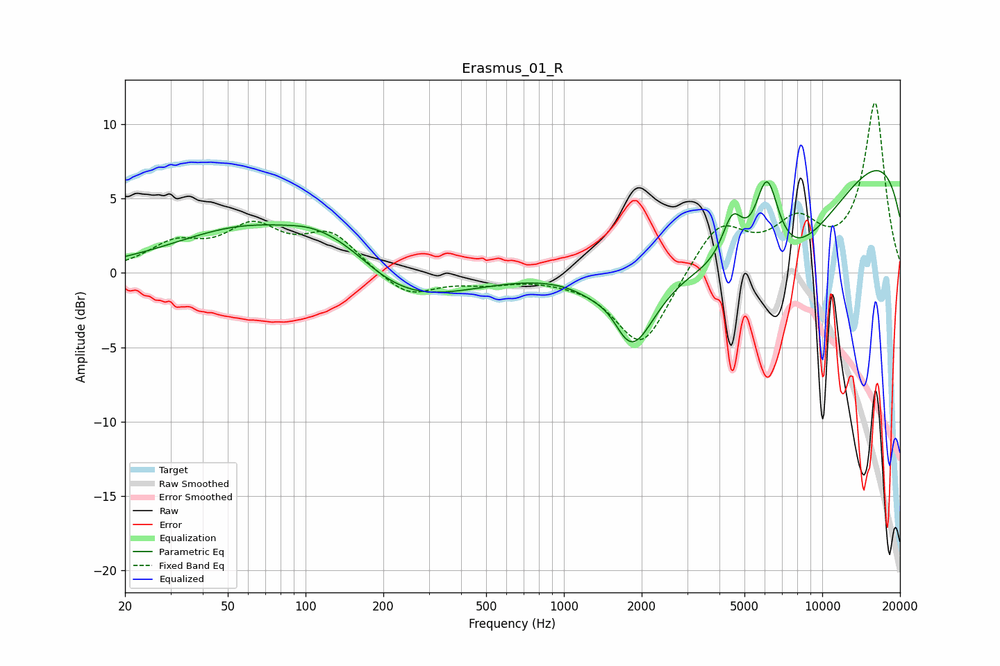

# Erasmus_01_R
See [usage instructions](https://github.com/jaakkopasanen/AutoEq#usage) for more options and info.

### Parametric EQs
Apply preamp of -7.0 dB when using parametric equalizer.

|   # | Type    |   Fc (Hz) |    Q |   Gain (dB) |
|-----|---------|-----------|------|-------------|
|   1 | Peaking |        63 | 0.48 |         3.2 |
|   2 | Peaking |       105 | 1.37 |         0.7 |
|   3 | Peaking |       144 | 1.03 |         1.6 |
|   4 | Peaking |       225 | 0.55 |        -2.6 |
|   5 | Peaking |      1555 | 2.19 |         1.8 |
|   6 | Peaking |      1779 | 1.39 |        -7.2 |
|   7 | Peaking |      4494 | 3.33 |         3.3 |
|   8 | Peaking |      6105 | 2.82 |         6.3 |
|   9 | Peaking |      6427 | 0.43 |       -11   |
|  10 | Peaking |     10000 | 0.18 |        11.4 |

### Fixed Band EQs
When using fixed band (also called graphic) equalizer, apply preamp of **-11.5 dB** (if available) and set gains manually with these parameters.

|   # | Type    |   Fc (Hz) |    Q |   Gain (dB) |
|-----|---------|-----------|------|-------------|
|   1 | Peaking |        31 | 1.41 |         1.7 |
|   2 | Peaking |        62 | 1.41 |         2.8 |
|   3 | Peaking |       125 | 1.41 |         2.5 |
|   4 | Peaking |       250 | 1.41 |        -1.6 |
|   5 | Peaking |       500 | 1.41 |        -0.5 |
|   6 | Peaking |      1000 | 1.41 |        -0.2 |
|   7 | Peaking |      2000 | 1.41 |        -5.1 |
|   8 | Peaking |      4000 | 1.41 |         3.4 |
|   9 | Peaking |      8000 | 1.41 |         3   |
|  10 | Peaking |     16000 | 1.41 |        11.4 |

### Graphs

