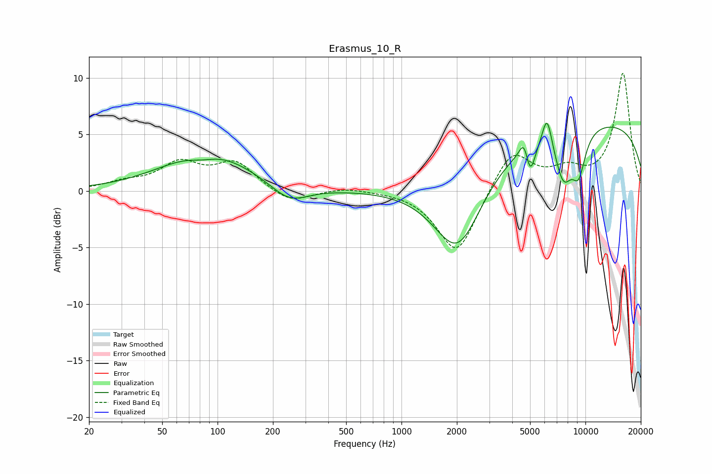

# Erasmus_10_R
See [usage instructions](https://github.com/jaakkopasanen/AutoEq#usage) for more options and info.

### Parametric EQs
Apply preamp of -6.1 dB when using parametric equalizer.

|   # | Type    |   Fc (Hz) |    Q |   Gain (dB) |
|-----|---------|-----------|------|-------------|
|   1 | Peaking |        83 | 1.73 |        -0.6 |
|   2 | Peaking |        88 | 0.61 |         3.5 |
|   3 | Peaking |       246 | 1.38 |        -1.6 |
|   4 | Peaking |      2029 | 1.04 |        -7.5 |
|   5 | Peaking |      4643 | 5.76 |         1.7 |
|   6 | Peaking |      5012 | 5.29 |        -2.7 |
|   7 | Peaking |      6187 | 5.16 |         3   |
|   8 | Peaking |      7596 | 2.69 |        -4.2 |
|   9 | Peaking |      9188 | 3.32 |        -3.5 |
|  10 | Peaking |     10000 | 0.18 |         6.3 |

### Fixed Band EQs
When using fixed band (also called graphic) equalizer, apply preamp of **-10.5 dB** (if available) and set gains manually with these parameters.

|   # | Type    |   Fc (Hz) |    Q |   Gain (dB) |
|-----|---------|-----------|------|-------------|
|   1 | Peaking |        31 | 1.41 |         0.6 |
|   2 | Peaking |        62 | 1.41 |         2.3 |
|   3 | Peaking |       125 | 1.41 |         2.4 |
|   4 | Peaking |       250 | 1.41 |        -1.2 |
|   5 | Peaking |       500 | 1.41 |         0.3 |
|   6 | Peaking |      1000 | 1.41 |         0.1 |
|   7 | Peaking |      2000 | 1.41 |        -5.7 |
|   8 | Peaking |      4000 | 1.41 |         3.7 |
|   9 | Peaking |      8000 | 1.41 |         1.5 |
|  10 | Peaking |     16000 | 1.41 |        10.4 |

### Graphs

