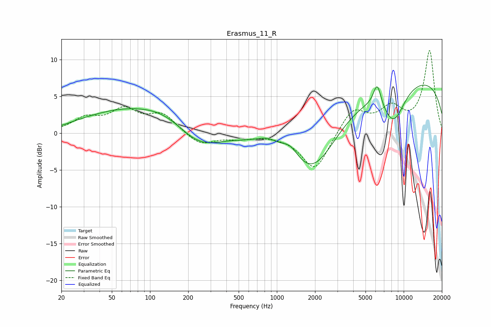

# Erasmus_11_R
See [usage instructions](https://github.com/jaakkopasanen/AutoEq#usage) for more options and info.

### Parametric EQs
Apply preamp of -6.6 dB when using parametric equalizer.

|   # | Type    |   Fc (Hz) |    Q |   Gain (dB) |
|-----|---------|-----------|------|-------------|
|   1 | Peaking |        20 | 2.34 |        -0.2 |
|   2 | Peaking |        75 | 0.36 |         3.4 |
|   3 | Peaking |       133 | 0.89 |         0.8 |
|   4 | Peaking |       241 | 0.81 |        -2.8 |
|   5 | Peaking |       847 | 1.69 |         1.1 |
|   6 | Peaking |      1276 | 1.95 |         1.9 |
|   7 | Peaking |      1901 | 0.69 |        -8.1 |
|   8 | Peaking |      6183 | 4.45 |         3.1 |
|   9 | Peaking |      8308 | 1.38 |        -5.3 |
|  10 | Peaking |     10000 | 0.18 |         7.8 |

### Fixed Band EQs
When using fixed band (also called graphic) equalizer, apply preamp of **-11.3 dB** (if available) and set gains manually with these parameters.

|   # | Type    |   Fc (Hz) |    Q |   Gain (dB) |
|-----|---------|-----------|------|-------------|
|   1 | Peaking |        31 | 1.41 |         1.8 |
|   2 | Peaking |        62 | 1.41 |         2.9 |
|   3 | Peaking |       125 | 1.41 |         2.4 |
|   4 | Peaking |       250 | 1.41 |        -1.7 |
|   5 | Peaking |       500 | 1.41 |        -0.6 |
|   6 | Peaking |      1000 | 1.41 |        -0.1 |
|   7 | Peaking |      2000 | 1.41 |        -5.2 |
|   8 | Peaking |      4000 | 1.41 |         3.4 |
|   9 | Peaking |      8000 | 1.41 |         3.1 |
|  10 | Peaking |     16000 | 1.41 |        11.2 |

### Graphs

