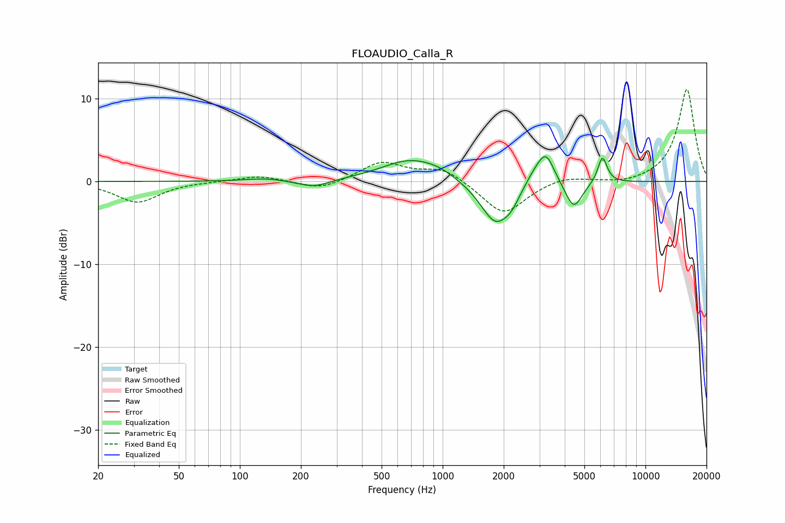

# FLOAUDIO_Calla_R
See [usage instructions](https://github.com/jaakkopasanen/AutoEq#usage) for more options and info.

### Parametric EQs
Apply preamp of -3.1 dB when using parametric equalizer.

|   # | Type    |   Fc (Hz) |    Q |   Gain (dB) |
|-----|---------|-----------|------|-------------|
|   1 | Peaking |       133 | 1.54 |         0.3 |
|   2 | Peaking |       231 | 1.84 |        -0.9 |
|   3 | Peaking |       695 | 0.98 |         2.6 |
|   4 | Peaking |       964 | 1.81 |         0.6 |
|   5 | Peaking |      1832 | 1.84 |        -5.3 |
|   6 | Peaking |      2187 | 4.01 |        -0.9 |
|   7 | Peaking |      2793 | 3.11 |         1.1 |
|   8 | Peaking |      3223 | 3.31 |         3.7 |
|   9 | Peaking |      4432 | 3.37 |        -3.4 |
|  10 | Peaking |      6134 | 5.96 |         3.2 |

### Fixed Band EQs
When using fixed band (also called graphic) equalizer, apply preamp of **-11.2 dB** (if available) and set gains manually with these parameters.

|   # | Type    |   Fc (Hz) |    Q |   Gain (dB) |
|-----|---------|-----------|------|-------------|
|   1 | Peaking |        31 | 1.41 |        -2.5 |
|   2 | Peaking |        62 | 1.41 |         0   |
|   3 | Peaking |       125 | 1.41 |         0.7 |
|   4 | Peaking |       250 | 1.41 |        -1.1 |
|   5 | Peaking |       500 | 1.41 |         2.3 |
|   6 | Peaking |      1000 | 1.41 |         1.6 |
|   7 | Peaking |      2000 | 1.41 |        -4.1 |
|   8 | Peaking |      4000 | 1.41 |         0.7 |
|   9 | Peaking |      8000 | 1.41 |        -0.4 |
|  10 | Peaking |     16000 | 1.41 |        11.2 |

### Graphs

