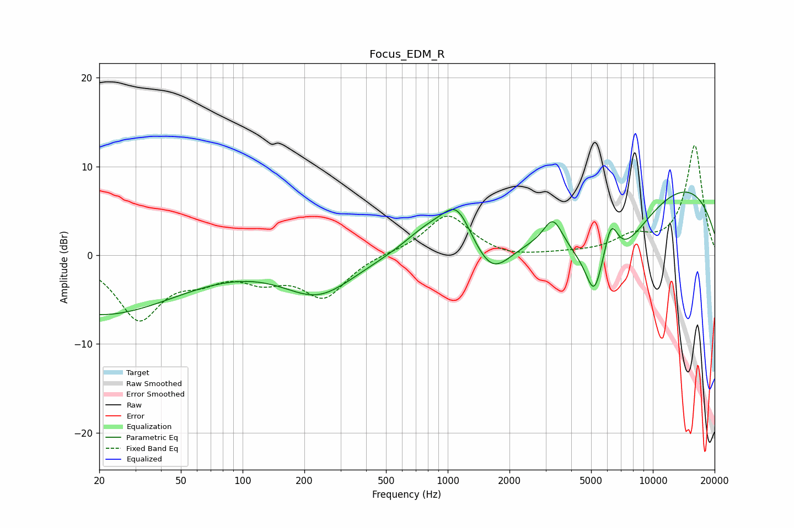

# Focus_EDM_R
See [usage instructions](https://github.com/jaakkopasanen/AutoEq#usage) for more options and info.

### Parametric EQs
Apply preamp of -7.2 dB when using parametric equalizer.

|   # | Type    |   Fc (Hz) |    Q |   Gain (dB) |
|-----|---------|-----------|------|-------------|
|   1 | Peaking |        20 | 0.36 |        -6.6 |
|   2 | Peaking |       234 | 0.81 |        -4.3 |
|   3 | Peaking |       804 | 1.14 |         2.6 |
|   4 | Peaking |      1111 | 1.94 |         4.4 |
|   5 | Peaking |      1639 | 1.5  |        -4.1 |
|   6 | Peaking |      3262 | 3.02 |         3.2 |
|   7 | Peaking |      5170 | 3.65 |        -4.2 |
|   8 | Peaking |      6122 | 0.7  |       -10.4 |
|   9 | Peaking |      6245 | 3.61 |         5.1 |
|  10 | Peaking |      9908 | 0.24 |        10.2 |

### Fixed Band EQs
When using fixed band (also called graphic) equalizer, apply preamp of **-12.4 dB** (if available) and set gains manually with these parameters.

|   # | Type    |   Fc (Hz) |    Q |   Gain (dB) |
|-----|---------|-----------|------|-------------|
|   1 | Peaking |        31 | 1.41 |        -6.9 |
|   2 | Peaking |        62 | 1.41 |        -1.9 |
|   3 | Peaking |       125 | 1.41 |        -2.2 |
|   4 | Peaking |       250 | 1.41 |        -4.5 |
|   5 | Peaking |       500 | 1.41 |         0.2 |
|   6 | Peaking |      1000 | 1.41 |         4.6 |
|   7 | Peaking |      2000 | 1.41 |        -0.4 |
|   8 | Peaking |      4000 | 1.41 |         0.1 |
|   9 | Peaking |      8000 | 1.41 |         1.8 |
|  10 | Peaking |     16000 | 1.41 |        12.4 |

### Graphs

