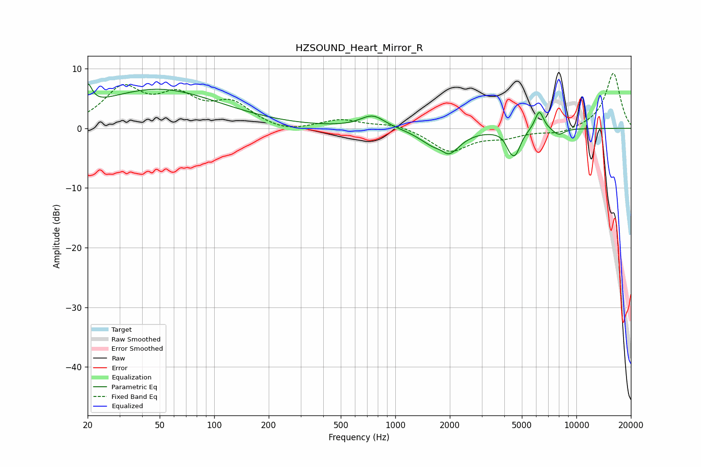

# HZSOUND_Heart_Mirror_R
See [usage instructions](https://github.com/jaakkopasanen/AutoEq#usage) for more options and info.

### Parametric EQs
Apply preamp of -7.5 dB when using parametric equalizer.

|   # | Type    |   Fc (Hz) |    Q |   Gain (dB) |
|-----|---------|-----------|------|-------------|
|   1 | Peaking |        20 | 6    |         3.6 |
|   2 | Peaking |        49 | 0.41 |         6.5 |
|   3 | Peaking |       750 | 2.07 |         2.2 |
|   4 | Peaking |      1581 | 1.76 |        -1.3 |
|   5 | Peaking |      1812 | 3.62 |         1.5 |
|   6 | Peaking |      1919 | 2.27 |        -4.7 |
|   7 | Peaking |      4275 | 6    |        -1.4 |
|   8 | Peaking |      4601 | 4.61 |        -3.7 |
|   9 | Peaking |      6236 | 5.57 |         3.3 |
|  10 | Peaking |      7980 | 4.02 |        -1.1 |

### Fixed Band EQs
When using fixed band (also called graphic) equalizer, apply preamp of **-9.3 dB** (if available) and set gains manually with these parameters.

|   # | Type    |   Fc (Hz) |    Q |   Gain (dB) |
|-----|---------|-----------|------|-------------|
|   1 | Peaking |        31 | 1.41 |         6.3 |
|   2 | Peaking |        62 | 1.41 |         4.6 |
|   3 | Peaking |       125 | 1.41 |         3.8 |
|   4 | Peaking |       250 | 1.41 |        -0.9 |
|   5 | Peaking |       500 | 1.41 |         1.4 |
|   6 | Peaking |      1000 | 1.41 |         0.8 |
|   7 | Peaking |      2000 | 1.41 |        -3.8 |
|   8 | Peaking |      4000 | 1.41 |        -1.2 |
|   9 | Peaking |      8000 | 1.41 |        -0.9 |
|  10 | Peaking |     16000 | 1.41 |         9.3 |

### Graphs

