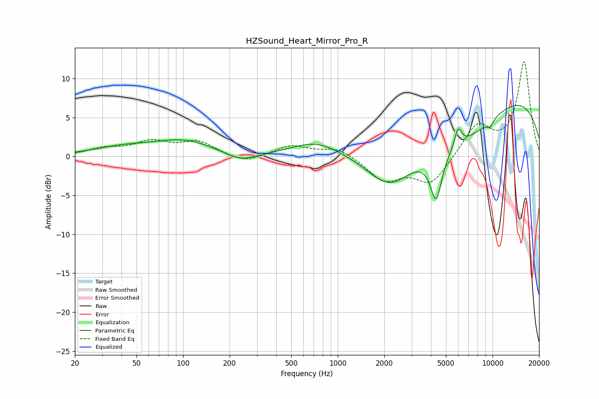

# HZSound_Heart_Mirror_Pro_R
See [usage instructions](https://github.com/jaakkopasanen/AutoEq#usage) for more options and info.

### Parametric EQs
Apply preamp of -6.7 dB when using parametric equalizer.

|   # | Type    |   Fc (Hz) |    Q |   Gain (dB) |
|-----|---------|-----------|------|-------------|
|   1 | Peaking |        40 | 0.75 |         0.9 |
|   2 | Peaking |       102 | 0.71 |         1.9 |
|   3 | Peaking |       235 | 1.38 |        -1.2 |
|   4 | Peaking |       722 | 0.9  |         1.8 |
|   5 | Peaking |      2167 | 0.9  |        -5.3 |
|   6 | Peaking |      4319 | 3.78 |        -6.1 |
|   7 | Peaking |      5993 | 5.92 |         2.4 |
|   8 | Peaking |      6752 | 0.42 |        -8.6 |
|   9 | Peaking |      9369 | 0.24 |        12.2 |
|  10 | Peaking |      9645 | 6    |        -0.8 |

### Fixed Band EQs
When using fixed band (also called graphic) equalizer, apply preamp of **-12.3 dB** (if available) and set gains manually with these parameters.

|   # | Type    |   Fc (Hz) |    Q |   Gain (dB) |
|-----|---------|-----------|------|-------------|
|   1 | Peaking |        31 | 1.41 |         0.9 |
|   2 | Peaking |        62 | 1.41 |         1.7 |
|   3 | Peaking |       125 | 1.41 |         1.8 |
|   4 | Peaking |       250 | 1.41 |        -0.9 |
|   5 | Peaking |       500 | 1.41 |         1.4 |
|   6 | Peaking |      1000 | 1.41 |         1.2 |
|   7 | Peaking |      2000 | 1.41 |        -3   |
|   8 | Peaking |      4000 | 1.41 |        -3.5 |
|   9 | Peaking |      8000 | 1.41 |         4   |
|  10 | Peaking |     16000 | 1.41 |        12.1 |

### Graphs

