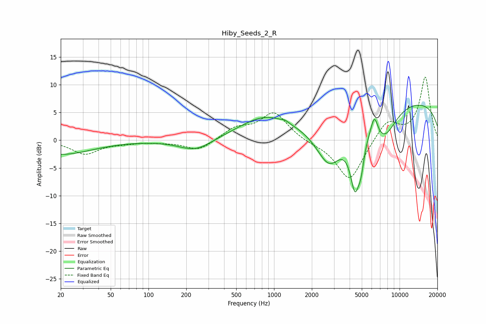

# Hiby_Seeds_2_R
See [usage instructions](https://github.com/jaakkopasanen/AutoEq#usage) for more options and info.

### Parametric EQs
Apply preamp of -6.4 dB when using parametric equalizer.

|   # | Type    |   Fc (Hz) |    Q |   Gain (dB) |
|-----|---------|-----------|------|-------------|
|   1 | Peaking |        20 | 0.57 |        -2.5 |
|   2 | Peaking |       237 | 1.09 |        -2.1 |
|   3 | Peaking |       846 | 0.67 |         3.9 |
|   4 | Peaking |      1220 | 5.92 |         0.3 |
|   5 | Peaking |      2751 | 1.27 |        -8.2 |
|   6 | Peaking |      4414 | 3.37 |       -10.3 |
|   7 | Peaking |      4927 | 5.7  |        -3.6 |
|   8 | Peaking |      6292 | 4.95 |         3.5 |
|   9 | Peaking |      7557 | 1.36 |        -5.3 |
|  10 | Peaking |     10000 | 0.18 |         7.4 |

### Fixed Band EQs
When using fixed band (also called graphic) equalizer, apply preamp of **-11.5 dB** (if available) and set gains manually with these parameters.

|   # | Type    |   Fc (Hz) |    Q |   Gain (dB) |
|-----|---------|-----------|------|-------------|
|   1 | Peaking |        31 | 1.41 |        -2.4 |
|   2 | Peaking |        62 | 1.41 |        -0.4 |
|   3 | Peaking |       125 | 1.41 |        -0.2 |
|   4 | Peaking |       250 | 1.41 |        -1.9 |
|   5 | Peaking |       500 | 1.41 |         2   |
|   6 | Peaking |      1000 | 1.41 |         4.9 |
|   7 | Peaking |      2000 | 1.41 |        -0.4 |
|   8 | Peaking |      4000 | 1.41 |        -7.5 |
|   9 | Peaking |      8000 | 1.41 |         3.6 |
|  10 | Peaking |     16000 | 1.41 |        11.3 |

### Graphs

