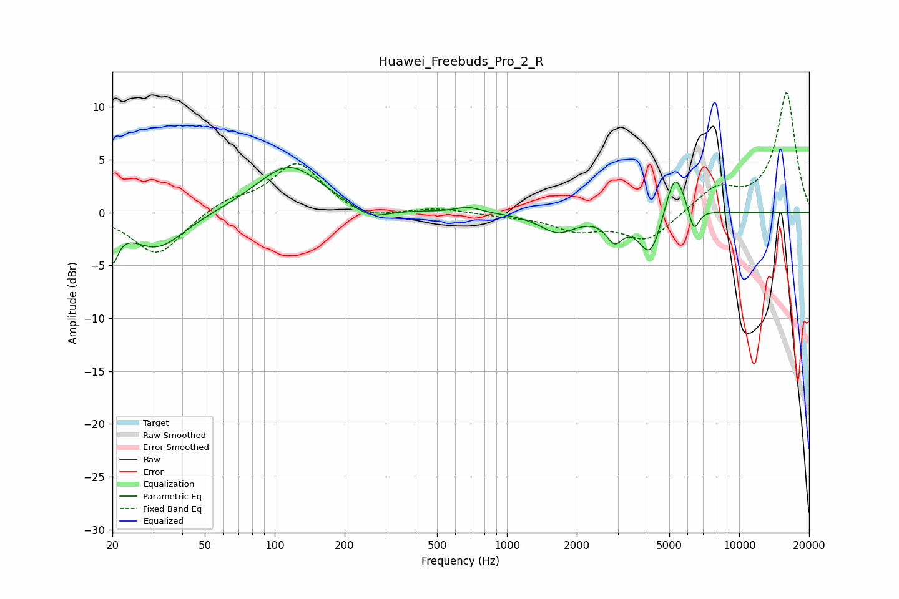

# Huawei_Freebuds_Pro_2_R
See [usage instructions](https://github.com/jaakkopasanen/AutoEq#usage) for more options and info.

### Parametric EQs
Apply preamp of -4.3 dB when using parametric equalizer.

|   # | Type    |   Fc (Hz) |    Q |   Gain (dB) |
|-----|---------|-----------|------|-------------|
|   1 | Peaking |        20 | 5.82 |        -3.3 |
|   2 | Peaking |        31 | 1.19 |        -3.5 |
|   3 | Peaking |       115 | 1.01 |         4.5 |
|   4 | Peaking |       258 | 1.87 |        -1.2 |
|   5 | Peaking |       682 | 2.67 |         0.5 |
|   6 | Peaking |      1655 | 1.84 |        -1.8 |
|   7 | Peaking |      2908 | 3.99 |        -2.1 |
|   8 | Peaking |      4154 | 2.82 |        -4.3 |
|   9 | Peaking |      5288 | 3.2  |         4.7 |
|  10 | Peaking |      6375 | 6    |        -2.4 |

### Fixed Band EQs
When using fixed band (also called graphic) equalizer, apply preamp of **-11.4 dB** (if available) and set gains manually with these parameters.

|   # | Type    |   Fc (Hz) |    Q |   Gain (dB) |
|-----|---------|-----------|------|-------------|
|   1 | Peaking |        31 | 1.41 |        -4.1 |
|   2 | Peaking |        62 | 1.41 |         1.1 |
|   3 | Peaking |       125 | 1.41 |         4.7 |
|   4 | Peaking |       250 | 1.41 |        -0.9 |
|   5 | Peaking |       500 | 1.41 |         0.4 |
|   6 | Peaking |      1000 | 1.41 |        -0.3 |
|   7 | Peaking |      2000 | 1.41 |        -1.5 |
|   8 | Peaking |      4000 | 1.41 |        -2.7 |
|   9 | Peaking |      8000 | 1.41 |         2.2 |
|  10 | Peaking |     16000 | 1.41 |        11.3 |

### Graphs

