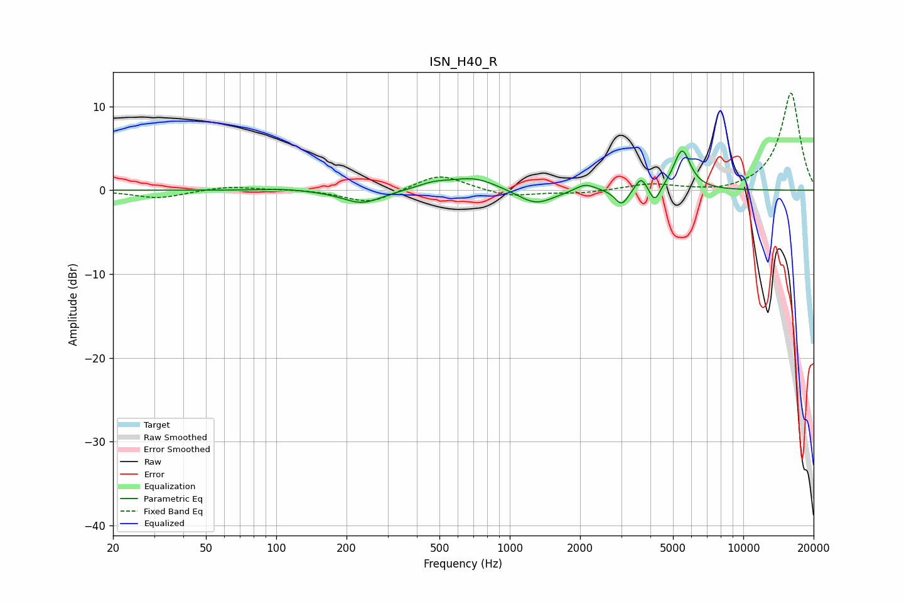

# ISN_H40_R
See [usage instructions](https://github.com/jaakkopasanen/AutoEq#usage) for more options and info.

### Parametric EQs
Apply preamp of -4.8 dB when using parametric equalizer.

|   # | Type    |   Fc (Hz) |    Q |   Gain (dB) |
|-----|---------|-----------|------|-------------|
|   1 | Peaking |       108 | 1.43 |         0.2 |
|   2 | Peaking |       233 | 1.66 |        -1.6 |
|   3 | Peaking |       472 | 1.98 |         0.7 |
|   4 | Peaking |       705 | 1.42 |         1.5 |
|   5 | Peaking |      1292 | 1.82 |        -1.8 |
|   6 | Peaking |      2108 | 3.28 |         0.9 |
|   7 | Peaking |      3014 | 5.06 |        -1.9 |
|   8 | Peaking |      3653 | 6    |         1.6 |
|   9 | Peaking |      4182 | 5.99 |        -2   |
|  10 | Peaking |      5467 | 3.87 |         4.8 |

### Fixed Band EQs
When using fixed band (also called graphic) equalizer, apply preamp of **-11.7 dB** (if available) and set gains manually with these parameters.

|   # | Type    |   Fc (Hz) |    Q |   Gain (dB) |
|-----|---------|-----------|------|-------------|
|   1 | Peaking |        31 | 1.41 |        -1   |
|   2 | Peaking |        62 | 1.41 |         0.5 |
|   3 | Peaking |       125 | 1.41 |         0.1 |
|   4 | Peaking |       250 | 1.41 |        -1.6 |
|   5 | Peaking |       500 | 1.41 |         2   |
|   6 | Peaking |      1000 | 1.41 |        -0.8 |
|   7 | Peaking |      2000 | 1.41 |        -0.4 |
|   8 | Peaking |      4000 | 1.41 |         0.7 |
|   9 | Peaking |      8000 | 1.41 |        -0.3 |
|  10 | Peaking |     16000 | 1.41 |        11.7 |

### Graphs

