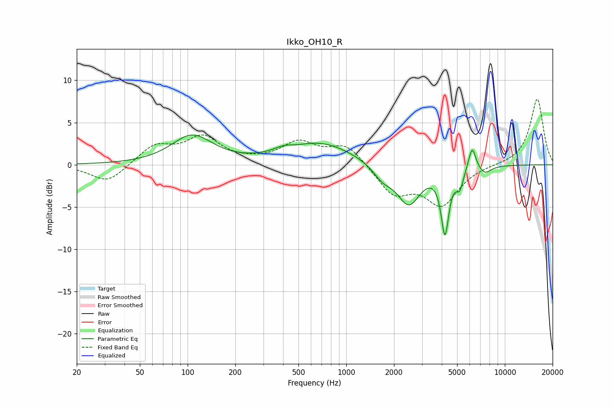

# Ikko_OH10_R
See [usage instructions](https://github.com/jaakkopasanen/AutoEq#usage) for more options and info.

### Parametric EQs
Apply preamp of -3.6 dB when using parametric equalizer.

|   # | Type    |   Fc (Hz) |    Q |   Gain (dB) |
|-----|---------|-----------|------|-------------|
|   1 | Peaking |       107 | 1.1  |         3.4 |
|   2 | Peaking |       412 | 2.2  |         0.7 |
|   3 | Peaking |       452 | 2.21 |        -0.2 |
|   4 | Peaking |       689 | 0.69 |         2.6 |
|   5 | Peaking |      1700 | 2.27 |        -1.5 |
|   6 | Peaking |      2480 | 1.91 |        -4.6 |
|   7 | Peaking |      4193 | 5.76 |        -7.4 |
|   8 | Peaking |      5193 | 6    |        -2.1 |
|   9 | Peaking |      6220 | 5.93 |         2.8 |
|  10 | Peaking |      7473 | 3.52 |        -0.9 |

### Fixed Band EQs
When using fixed band (also called graphic) equalizer, apply preamp of **-7.9 dB** (if available) and set gains manually with these parameters.

|   # | Type    |   Fc (Hz) |    Q |   Gain (dB) |
|-----|---------|-----------|------|-------------|
|   1 | Peaking |        31 | 1.41 |        -2.2 |
|   2 | Peaking |        62 | 1.41 |         2.2 |
|   3 | Peaking |       125 | 1.41 |         3.1 |
|   4 | Peaking |       250 | 1.41 |         0.2 |
|   5 | Peaking |       500 | 1.41 |         2.5 |
|   6 | Peaking |      1000 | 1.41 |         2.4 |
|   7 | Peaking |      2000 | 1.41 |        -3.4 |
|   8 | Peaking |      4000 | 1.41 |        -4.5 |
|   9 | Peaking |      8000 | 1.41 |         0   |
|  10 | Peaking |     16000 | 1.41 |         7.9 |

### Graphs

