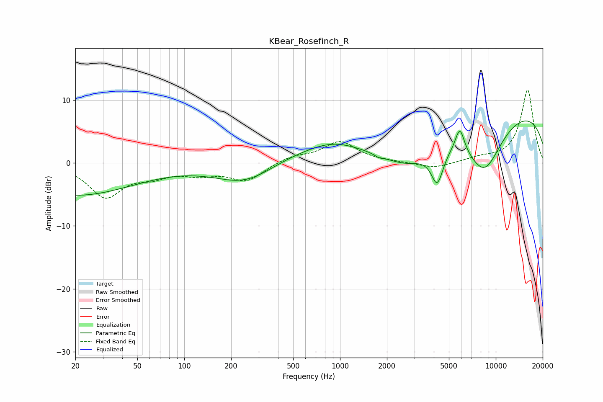

# KBear_Rosefinch_R
See [usage instructions](https://github.com/jaakkopasanen/AutoEq#usage) for more options and info.

### Parametric EQs
Apply preamp of -6.8 dB when using parametric equalizer.

|   # | Type    |   Fc (Hz) |    Q |   Gain (dB) |
|-----|---------|-----------|------|-------------|
|   1 | Peaking |        20 | 0.37 |        -5.1 |
|   2 | Peaking |       250 | 0.7  |        -4.2 |
|   3 | Peaking |       617 | 0.34 |         2.5 |
|   4 | Peaking |       897 | 1    |         1.1 |
|   5 | Peaking |      1776 | 5.74 |        -0.3 |
|   6 | Peaking |      2723 | 0.72 |        -5.4 |
|   7 | Peaking |      4210 | 3.56 |        -5.4 |
|   8 | Peaking |      5878 | 4.71 |         3.9 |
|   9 | Peaking |      8433 | 1.05 |        -9   |
|  10 | Peaking |      9985 | 0.18 |         9.1 |

### Fixed Band EQs
When using fixed band (also called graphic) equalizer, apply preamp of **-11.7 dB** (if available) and set gains manually with these parameters.

|   # | Type    |   Fc (Hz) |    Q |   Gain (dB) |
|-----|---------|-----------|------|-------------|
|   1 | Peaking |        31 | 1.41 |        -5.2 |
|   2 | Peaking |        62 | 1.41 |        -1.6 |
|   3 | Peaking |       125 | 1.41 |        -1.4 |
|   4 | Peaking |       250 | 1.41 |        -2.7 |
|   5 | Peaking |       500 | 1.41 |         1   |
|   6 | Peaking |      1000 | 1.41 |         3.3 |
|   7 | Peaking |      2000 | 1.41 |         0.1 |
|   8 | Peaking |      4000 | 1.41 |        -0.9 |
|   9 | Peaking |      8000 | 1.41 |         0.7 |
|  10 | Peaking |     16000 | 1.41 |        11.6 |

### Graphs

