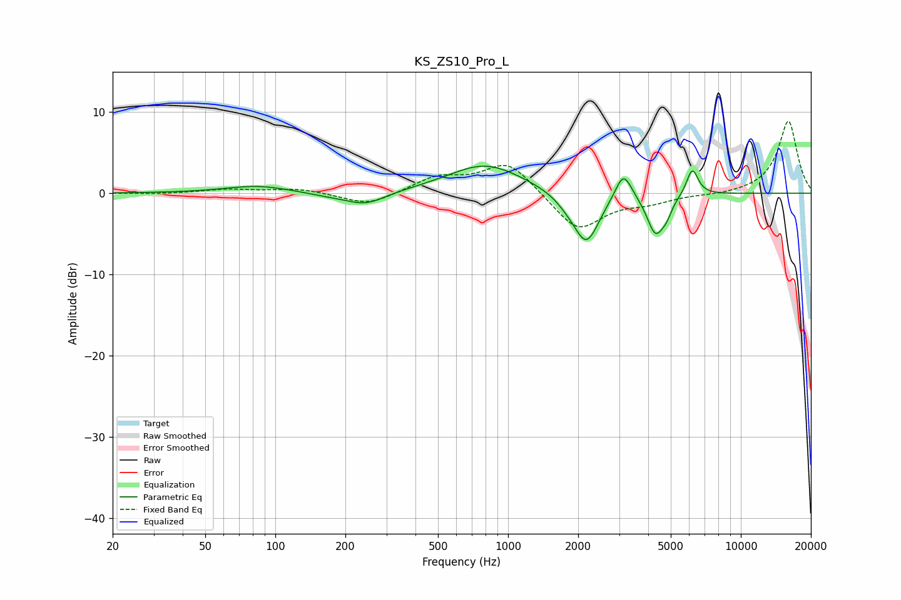

# KS_ZS10_Pro_L
See [usage instructions](https://github.com/jaakkopasanen/AutoEq#usage) for more options and info.

### Parametric EQs
Apply preamp of -3.4 dB when using parametric equalizer.

|   # | Type    |   Fc (Hz) |    Q |   Gain (dB) |
|-----|---------|-----------|------|-------------|
|   1 | Peaking |        84 | 1.01 |         0.9 |
|   2 | Peaking |       173 | 1.36 |        -0.4 |
|   3 | Peaking |       245 | 1.64 |        -1.5 |
|   4 | Peaking |       799 | 0.88 |         3.6 |
|   5 | Peaking |      1813 | 2.55 |        -0.8 |
|   6 | Peaking |      2173 | 2.54 |        -6.2 |
|   7 | Peaking |      3131 | 3.94 |         3.5 |
|   8 | Peaking |      4299 | 3.82 |        -4.8 |
|   9 | Peaking |      4793 | 6    |        -1.3 |
|  10 | Peaking |      6189 | 5.54 |         3.3 |

### Fixed Band EQs
When using fixed band (also called graphic) equalizer, apply preamp of **-8.9 dB** (if available) and set gains manually with these parameters.

|   # | Type    |   Fc (Hz) |    Q |   Gain (dB) |
|-----|---------|-----------|------|-------------|
|   1 | Peaking |        31 | 1.41 |        -0.1 |
|   2 | Peaking |        62 | 1.41 |         0.5 |
|   3 | Peaking |       125 | 1.41 |         0.6 |
|   4 | Peaking |       250 | 1.41 |        -1.6 |
|   5 | Peaking |       500 | 1.41 |         1.9 |
|   6 | Peaking |      1000 | 1.41 |         3.9 |
|   7 | Peaking |      2000 | 1.41 |        -4.7 |
|   8 | Peaking |      4000 | 1.41 |        -1   |
|   9 | Peaking |      8000 | 1.41 |        -0.2 |
|  10 | Peaking |     16000 | 1.41 |         8.9 |

### Graphs

