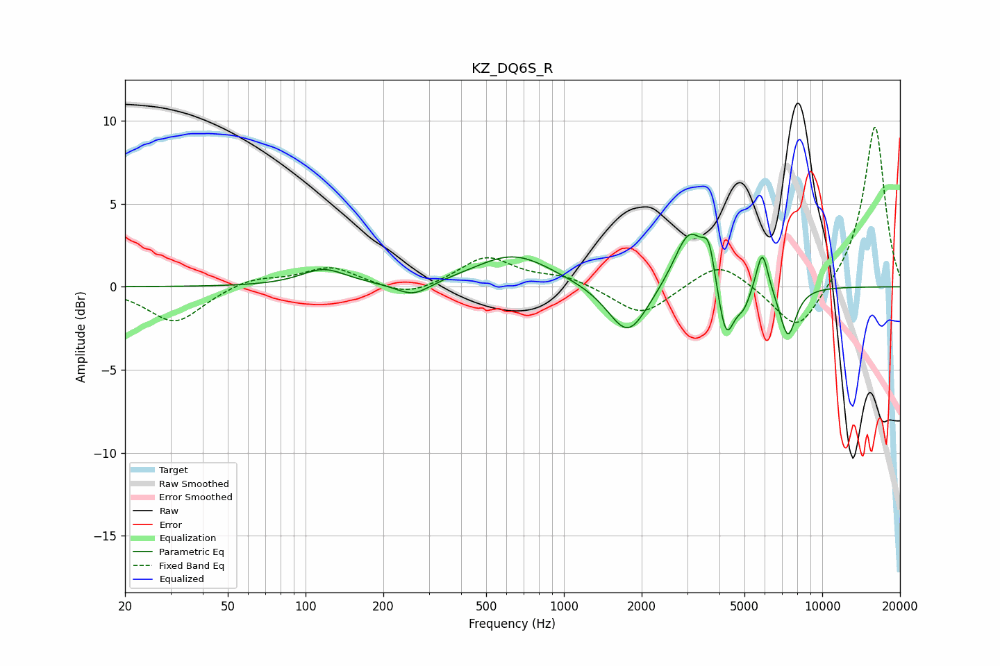

# KZ_DQ6S_R
See [usage instructions](https://github.com/jaakkopasanen/AutoEq#usage) for more options and info.

### Parametric EQs
Apply preamp of -3.3 dB when using parametric equalizer.

|   # | Type    |   Fc (Hz) |    Q |   Gain (dB) |
|-----|---------|-----------|------|-------------|
|   1 | Peaking |       118 | 1.61 |         1   |
|   2 | Peaking |       261 | 2.11 |        -0.9 |
|   3 | Peaking |       639 | 0.94 |         2   |
|   4 | Peaking |      1770 | 1.83 |        -3.2 |
|   5 | Peaking |      3067 | 2.34 |         3.6 |
|   6 | Peaking |      3645 | 5.97 |         2.1 |
|   7 | Peaking |      4240 | 4.38 |        -3.6 |
|   8 | Peaking |      4963 | 4.96 |        -1   |
|   9 | Peaking |      5860 | 5.97 |         2.6 |
|  10 | Peaking |      7362 | 4.14 |        -3   |

### Fixed Band EQs
When using fixed band (also called graphic) equalizer, apply preamp of **-9.7 dB** (if available) and set gains manually with these parameters.

|   # | Type    |   Fc (Hz) |    Q |   Gain (dB) |
|-----|---------|-----------|------|-------------|
|   1 | Peaking |        31 | 1.41 |        -2.2 |
|   2 | Peaking |        62 | 1.41 |         0.6 |
|   3 | Peaking |       125 | 1.41 |         1.2 |
|   4 | Peaking |       250 | 1.41 |        -0.7 |
|   5 | Peaking |       500 | 1.41 |         1.8 |
|   6 | Peaking |      1000 | 1.41 |         0.6 |
|   7 | Peaking |      2000 | 1.41 |        -1.8 |
|   8 | Peaking |      4000 | 1.41 |         1.6 |
|   9 | Peaking |      8000 | 1.41 |        -2.9 |
|  10 | Peaking |     16000 | 1.41 |         9.8 |

### Graphs

