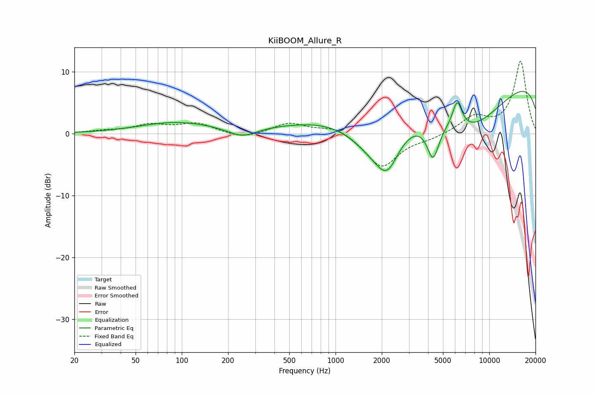

# KiiBOOM_Allure_R
See [usage instructions](https://github.com/jaakkopasanen/AutoEq#usage) for more options and info.

### Parametric EQs
Apply preamp of -7.0 dB when using parametric equalizer.

|   # | Type    |   Fc (Hz) |    Q |   Gain (dB) |
|-----|---------|-----------|------|-------------|
|   1 | Peaking |        90 | 0.59 |         1.8 |
|   2 | Peaking |       247 | 1.45 |        -1.8 |
|   3 | Peaking |       261 | 0.66 |         0.5 |
|   4 | Peaking |      1762 | 0.8  |        -7   |
|   5 | Peaking |      1889 | 0.32 |         3.7 |
|   6 | Peaking |      2170 | 1.83 |        -5.7 |
|   7 | Peaking |      4312 | 3.58 |        -5.8 |
|   8 | Peaking |      6191 | 4.35 |         4.4 |
|   9 | Peaking |      7291 | 0.4  |       -13   |
|  10 | Peaking |      9599 | 0.18 |        13.9 |

### Fixed Band EQs
When using fixed band (also called graphic) equalizer, apply preamp of **-11.8 dB** (if available) and set gains manually with these parameters.

|   # | Type    |   Fc (Hz) |    Q |   Gain (dB) |
|-----|---------|-----------|------|-------------|
|   1 | Peaking |        31 | 1.41 |         0.4 |
|   2 | Peaking |        62 | 1.41 |         1.3 |
|   3 | Peaking |       125 | 1.41 |         1.6 |
|   4 | Peaking |       250 | 1.41 |        -0.9 |
|   5 | Peaking |       500 | 1.41 |         1.7 |
|   6 | Peaking |      1000 | 1.41 |         1.3 |
|   7 | Peaking |      2000 | 1.41 |        -5.5 |
|   8 | Peaking |      4000 | 1.41 |        -0.6 |
|   9 | Peaking |      8000 | 1.41 |         2.6 |
|  10 | Peaking |     16000 | 1.41 |        11.7 |

### Graphs

