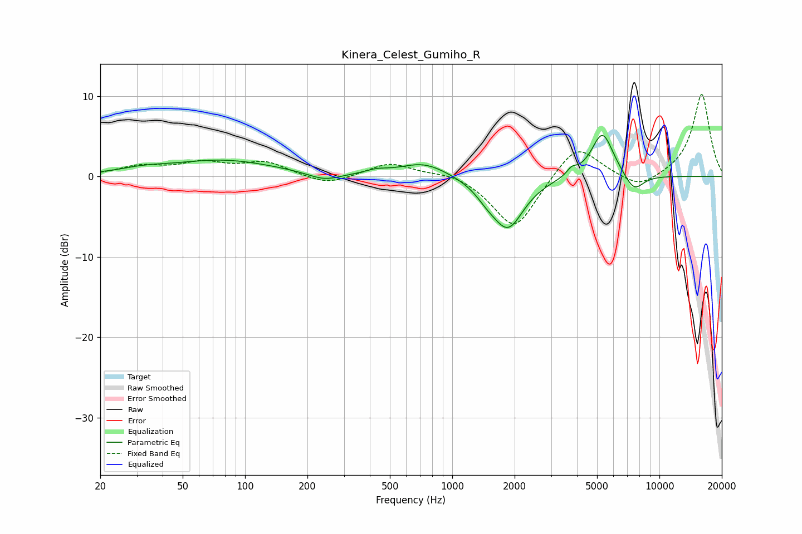

# Kinera_Celest_Gumiho_R
See [usage instructions](https://github.com/jaakkopasanen/AutoEq#usage) for more options and info.

### Parametric EQs
Apply preamp of -5.2 dB when using parametric equalizer.

|   # | Type    |   Fc (Hz) |    Q |   Gain (dB) |
|-----|---------|-----------|------|-------------|
|   1 | Peaking |        32 | 1.23 |         0.5 |
|   2 | Peaking |        78 | 0.57 |         2   |
|   3 | Peaking |       241 | 1.8  |        -1   |
|   4 | Peaking |       429 | 2.71 |         0.4 |
|   5 | Peaking |       730 | 1.2  |         1.8 |
|   6 | Peaking |      1469 | 2.58 |        -1.1 |
|   7 | Peaking |      1858 | 1.82 |        -6.3 |
|   8 | Peaking |      3774 | 5.99 |         0.8 |
|   9 | Peaking |      5308 | 2.59 |         5.7 |
|  10 | Peaking |      7532 | 2.84 |        -2.2 |

### Fixed Band EQs
When using fixed band (also called graphic) equalizer, apply preamp of **-10.3 dB** (if available) and set gains manually with these parameters.

|   # | Type    |   Fc (Hz) |    Q |   Gain (dB) |
|-----|---------|-----------|------|-------------|
|   1 | Peaking |        31 | 1.41 |         1.2 |
|   2 | Peaking |        62 | 1.41 |         1.5 |
|   3 | Peaking |       125 | 1.41 |         1.7 |
|   4 | Peaking |       250 | 1.41 |        -1.2 |
|   5 | Peaking |       500 | 1.41 |         1.7 |
|   6 | Peaking |      1000 | 1.41 |         0.7 |
|   7 | Peaking |      2000 | 1.41 |        -6.8 |
|   8 | Peaking |      4000 | 1.41 |         4.3 |
|   9 | Peaking |      8000 | 1.41 |        -1.7 |
|  10 | Peaking |     16000 | 1.41 |        10.3 |

### Graphs

