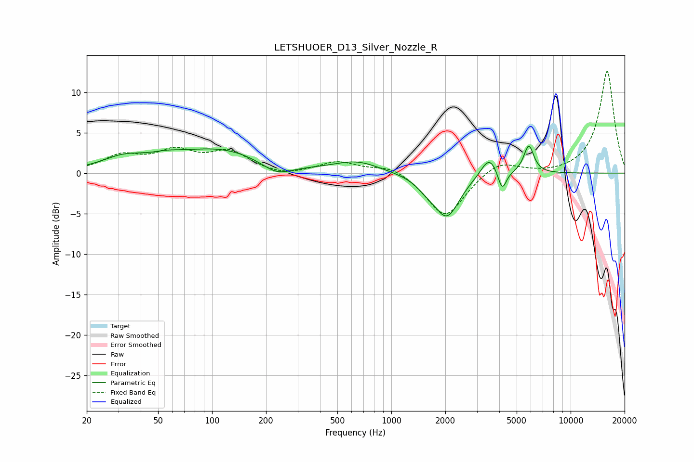

# LETSHUOER_D13_Silver_Nozzle_R
See [usage instructions](https://github.com/jaakkopasanen/AutoEq#usage) for more options and info.

### Parametric EQs
Apply preamp of -3.4 dB when using parametric equalizer.

|   # | Type    |   Fc (Hz) |    Q |   Gain (dB) |
|-----|---------|-----------|------|-------------|
|   1 | Peaking |        32 | 1.16 |         1.5 |
|   2 | Peaking |        55 | 1.68 |         0.5 |
|   3 | Peaking |       110 | 0.53 |         2.9 |
|   4 | Peaking |       230 | 1.57 |        -1.6 |
|   5 | Peaking |       643 | 1.13 |         1.4 |
|   6 | Peaking |      1583 | 2.41 |        -0.9 |
|   7 | Peaking |      2043 | 2    |        -5.2 |
|   8 | Peaking |      3516 | 3.09 |         2.5 |
|   9 | Peaking |      4152 | 6    |        -2.5 |
|  10 | Peaking |      5844 | 4.97 |         3.5 |

### Fixed Band EQs
When using fixed band (also called graphic) equalizer, apply preamp of **-12.7 dB** (if available) and set gains manually with these parameters.

|   # | Type    |   Fc (Hz) |    Q |   Gain (dB) |
|-----|---------|-----------|------|-------------|
|   1 | Peaking |        31 | 1.41 |         2   |
|   2 | Peaking |        62 | 1.41 |         2.4 |
|   3 | Peaking |       125 | 1.41 |         2.4 |
|   4 | Peaking |       250 | 1.41 |        -0.5 |
|   5 | Peaking |       500 | 1.41 |         1.4 |
|   6 | Peaking |      1000 | 1.41 |         1.1 |
|   7 | Peaking |      2000 | 1.41 |        -5.6 |
|   8 | Peaking |      4000 | 1.41 |         1.7 |
|   9 | Peaking |      8000 | 1.41 |        -0.2 |
|  10 | Peaking |     16000 | 1.41 |        12.7 |

### Graphs

