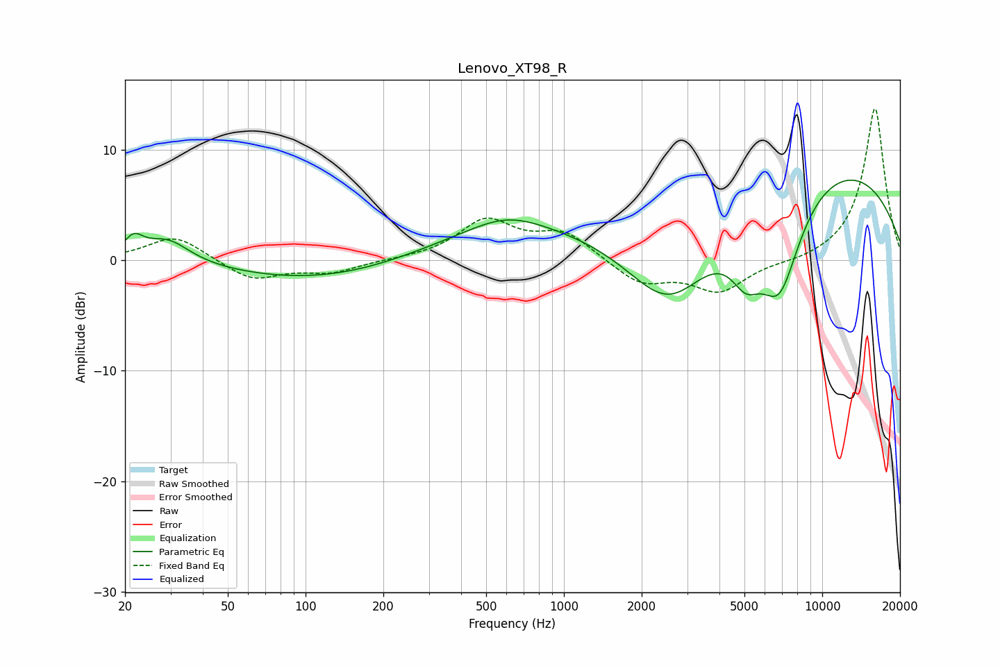

# Lenovo_XT98_R
See [usage instructions](https://github.com/jaakkopasanen/AutoEq#usage) for more options and info.

### Parametric EQs
Apply preamp of -7.3 dB when using parametric equalizer.

|   # | Type    |   Fc (Hz) |    Q |   Gain (dB) |
|-----|---------|-----------|------|-------------|
|   1 | Peaking |        22 | 3.83 |         1.7 |
|   2 | Peaking |        29 | 1.64 |         2.2 |
|   3 | Peaking |       124 | 0.38 |        -2.1 |
|   4 | Peaking |       599 | 1.01 |         1.5 |
|   5 | Peaking |       857 | 0.27 |         3.3 |
|   6 | Peaking |      2548 | 0.79 |        -8.4 |
|   7 | Peaking |      5066 | 2.31 |        -3.6 |
|   8 | Peaking |      6821 | 1.54 |        -9.2 |
|   9 | Peaking |      9440 | 5.69 |         0   |
|  10 | Peaking |      9620 | 0.27 |         9.1 |

### Fixed Band EQs
When using fixed band (also called graphic) equalizer, apply preamp of **-13.8 dB** (if available) and set gains manually with these parameters.

|   # | Type    |   Fc (Hz) |    Q |   Gain (dB) |
|-----|---------|-----------|------|-------------|
|   1 | Peaking |        31 | 1.41 |         2.3 |
|   2 | Peaking |        62 | 1.41 |        -1.8 |
|   3 | Peaking |       125 | 1.41 |        -1.1 |
|   4 | Peaking |       250 | 1.41 |         0   |
|   5 | Peaking |       500 | 1.41 |         3.5 |
|   6 | Peaking |      1000 | 1.41 |         2.4 |
|   7 | Peaking |      2000 | 1.41 |        -2.1 |
|   8 | Peaking |      4000 | 1.41 |        -2.8 |
|   9 | Peaking |      8000 | 1.41 |        -0.3 |
|  10 | Peaking |     16000 | 1.41 |        13.8 |

### Graphs

