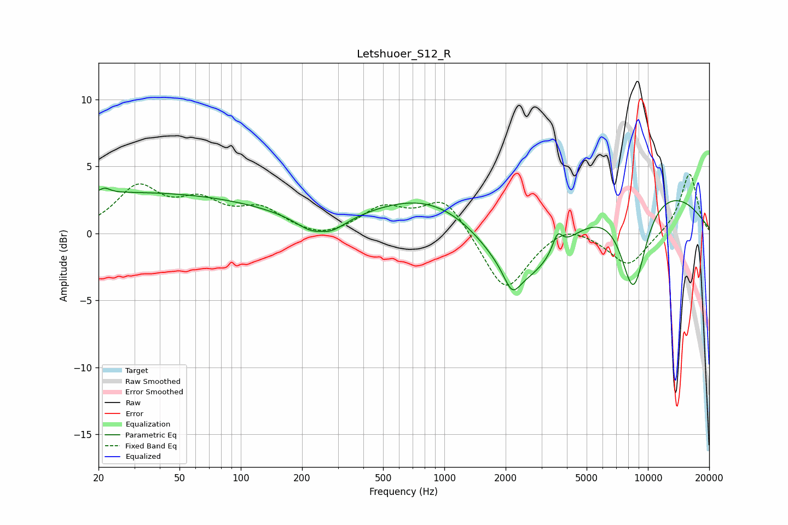

# Letshuoer_S12_R
See [usage instructions](https://github.com/jaakkopasanen/AutoEq#usage) for more options and info.

### Parametric EQs
Apply preamp of -3.5 dB when using parametric equalizer.

|   # | Type    |   Fc (Hz) |    Q |   Gain (dB) |
|-----|---------|-----------|------|-------------|
|   1 | Peaking |        21 | 5.61 |         0.4 |
|   2 | Peaking |        29 | 0.18 |         3   |
|   3 | Peaking |       247 | 2.86 |         0.8 |
|   4 | Peaking |       248 | 1.66 |        -2.4 |
|   5 | Peaking |       936 | 0.46 |         3.3 |
|   6 | Peaking |      2152 | 3.61 |        -1.7 |
|   7 | Peaking |      2434 | 0.71 |        -5.9 |
|   8 | Peaking |      3593 | 6    |         1.3 |
|   9 | Peaking |      8484 | 2    |        -7.1 |
|  10 | Peaking |      8854 | 0.31 |         4   |

### Fixed Band EQs
When using fixed band (also called graphic) equalizer, apply preamp of **-4.5 dB** (if available) and set gains manually with these parameters.

|   # | Type    |   Fc (Hz) |    Q |   Gain (dB) |
|-----|---------|-----------|------|-------------|
|   1 | Peaking |        31 | 1.41 |         3.3 |
|   2 | Peaking |        62 | 1.41 |         2   |
|   3 | Peaking |       125 | 1.41 |         1.6 |
|   4 | Peaking |       250 | 1.41 |        -0.6 |
|   5 | Peaking |       500 | 1.41 |         1.8 |
|   6 | Peaking |      1000 | 1.41 |         2.7 |
|   7 | Peaking |      2000 | 1.41 |        -4.5 |
|   8 | Peaking |      4000 | 1.41 |         0.9 |
|   9 | Peaking |      8000 | 1.41 |        -2.5 |
|  10 | Peaking |     16000 | 1.41 |         4.6 |

### Graphs

