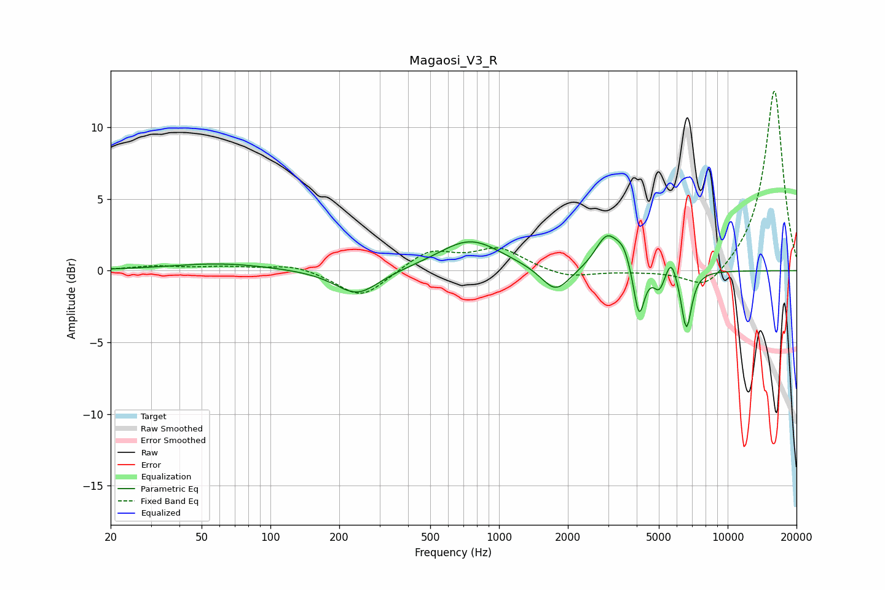

# Magaosi_V3_R
See [usage instructions](https://github.com/jaakkopasanen/AutoEq#usage) for more options and info.

### Parametric EQs
Apply preamp of -2.5 dB when using parametric equalizer.

|   # | Type    |   Fc (Hz) |    Q |   Gain (dB) |
|-----|---------|-----------|------|-------------|
|   1 | Peaking |        61 | 0.64 |         0.5 |
|   2 | Peaking |       240 | 1.47 |        -1.8 |
|   3 | Peaking |       748 | 1.03 |         2.2 |
|   4 | Peaking |      1768 | 2.26 |        -1.8 |
|   5 | Peaking |      2964 | 2.78 |         2.4 |
|   6 | Peaking |      3507 | 4.34 |         1.2 |
|   7 | Peaking |      4094 | 6    |        -3.6 |
|   8 | Peaking |      5020 | 6    |        -1.3 |
|   9 | Peaking |      5666 | 5.98 |         1.4 |
|  10 | Peaking |      6600 | 6    |        -4.1 |

### Fixed Band EQs
When using fixed band (also called graphic) equalizer, apply preamp of **-12.6 dB** (if available) and set gains manually with these parameters.

|   # | Type    |   Fc (Hz) |    Q |   Gain (dB) |
|-----|---------|-----------|------|-------------|
|   1 | Peaking |        31 | 1.41 |         0.3 |
|   2 | Peaking |        62 | 1.41 |         0.2 |
|   3 | Peaking |       125 | 1.41 |         0.5 |
|   4 | Peaking |       250 | 1.41 |        -2   |
|   5 | Peaking |       500 | 1.41 |         1.4 |
|   6 | Peaking |      1000 | 1.41 |         1.5 |
|   7 | Peaking |      2000 | 1.41 |        -0.6 |
|   8 | Peaking |      4000 | 1.41 |        -0.1 |
|   9 | Peaking |      8000 | 1.41 |        -1.6 |
|  10 | Peaking |     16000 | 1.41 |        12.7 |

### Graphs

