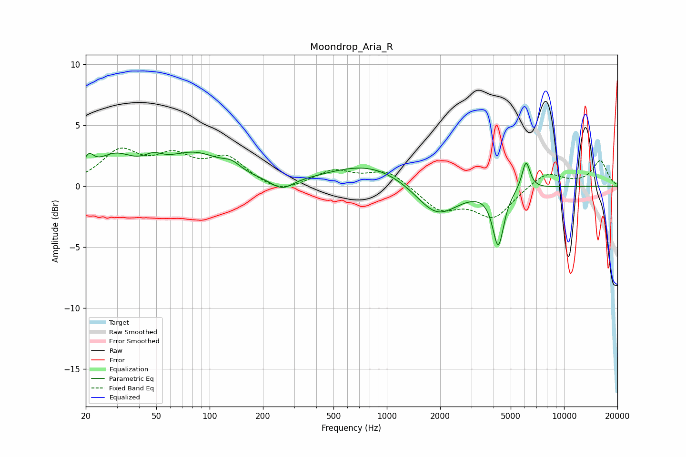

# Moondrop_Aria_R
See [usage instructions](https://github.com/jaakkopasanen/AutoEq#usage) for more options and info.

### Parametric EQs
Apply preamp of -2.9 dB when using parametric equalizer.

|   # | Type    |   Fc (Hz) |    Q |   Gain (dB) |
|-----|---------|-----------|------|-------------|
|   1 | Peaking |        21 | 4.88 |         1.3 |
|   2 | Peaking |        29 | 1.34 |         2.1 |
|   3 | Peaking |        48 | 2.59 |         0.8 |
|   4 | Peaking |        82 | 0.88 |         2.4 |
|   5 | Peaking |       133 | 2.71 |         0.6 |
|   6 | Peaking |       257 | 2.26 |        -0.9 |
|   7 | Peaking |       799 | 0.62 |         1.8 |
|   8 | Peaking |      1917 | 1.18 |        -2.7 |
|   9 | Peaking |      4253 | 4.49 |        -4.6 |
|  10 | Peaking |      6099 | 5.97 |         2.4 |

### Fixed Band EQs
When using fixed band (also called graphic) equalizer, apply preamp of **-3.2 dB** (if available) and set gains manually with these parameters.

|   # | Type    |   Fc (Hz) |    Q |   Gain (dB) |
|-----|---------|-----------|------|-------------|
|   1 | Peaking |        31 | 1.41 |         2.7 |
|   2 | Peaking |        62 | 1.41 |         2.1 |
|   3 | Peaking |       125 | 1.41 |         2.1 |
|   4 | Peaking |       250 | 1.41 |        -0.7 |
|   5 | Peaking |       500 | 1.41 |         1.2 |
|   6 | Peaking |      1000 | 1.41 |         1.3 |
|   7 | Peaking |      2000 | 1.41 |        -1.9 |
|   8 | Peaking |      4000 | 1.41 |        -2.5 |
|   9 | Peaking |      8000 | 1.41 |         1.2 |
|  10 | Peaking |     16000 | 1.41 |         2.1 |

### Graphs

