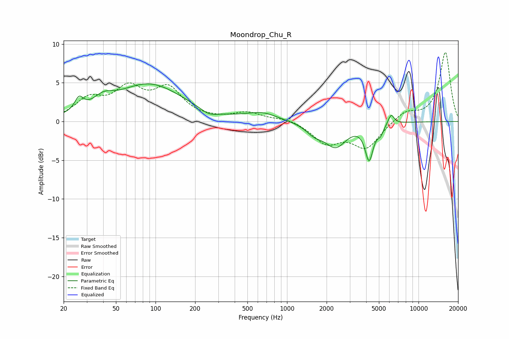

# Moondrop_Chu_R
See [usage instructions](https://github.com/jaakkopasanen/AutoEq#usage) for more options and info.

### Parametric EQs
Apply preamp of -5.0 dB when using parametric equalizer.

|   # | Type    |   Fc (Hz) |    Q |   Gain (dB) |
|-----|---------|-----------|------|-------------|
|   1 | Peaking |        26 | 4.37 |         1.7 |
|   2 | Peaking |        40 | 1.9  |         1.4 |
|   3 | Peaking |        90 | 0.55 |         4.7 |
|   4 | Peaking |       255 | 2.2  |        -0.7 |
|   5 | Peaking |       647 | 1.22 |         1   |
|   6 | Peaking |      1616 | 2.16 |        -1.2 |
|   7 | Peaking |      2344 | 1.75 |        -3   |
|   8 | Peaking |      4212 | 4.64 |        -4.5 |
|   9 | Peaking |      5136 | 6    |        -1   |
|  10 | Peaking |      6188 | 5.99 |         1.4 |

### Fixed Band EQs
When using fixed band (also called graphic) equalizer, apply preamp of **-9.0 dB** (if available) and set gains manually with these parameters.

|   # | Type    |   Fc (Hz) |    Q |   Gain (dB) |
|-----|---------|-----------|------|-------------|
|   1 | Peaking |        31 | 1.41 |         2.6 |
|   2 | Peaking |        62 | 1.41 |         3.8 |
|   3 | Peaking |       125 | 1.41 |         3.9 |
|   4 | Peaking |       250 | 1.41 |         0.1 |
|   5 | Peaking |       500 | 1.41 |         1.1 |
|   6 | Peaking |      1000 | 1.41 |         0.5 |
|   7 | Peaking |      2000 | 1.41 |        -2.6 |
|   8 | Peaking |      4000 | 1.41 |        -3.3 |
|   9 | Peaking |      8000 | 1.41 |         1.3 |
|  10 | Peaking |     16000 | 1.41 |         8.9 |

### Graphs

