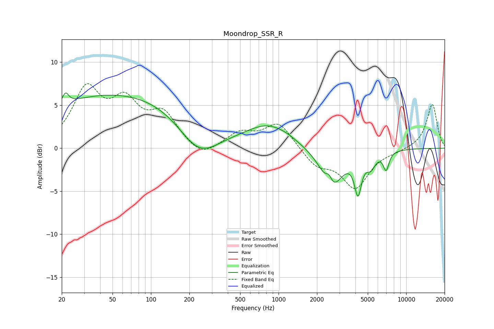

# Moondrop_SSR_R
See [usage instructions](https://github.com/jaakkopasanen/AutoEq#usage) for more options and info.

### Parametric EQs
Apply preamp of -6.5 dB when using parametric equalizer.

|   # | Type    |   Fc (Hz) |    Q |   Gain (dB) |
|-----|---------|-----------|------|-------------|
|   1 | Peaking |        21 | 5.81 |         1.3 |
|   2 | Peaking |        61 | 0.2  |         6.5 |
|   3 | Peaking |       237 | 0.86 |        -4.4 |
|   4 | Peaking |       839 | 0.84 |         2.4 |
|   5 | Peaking |      1162 | 2.2  |         0.2 |
|   6 | Peaking |      2482 | 5.72 |         1.2 |
|   7 | Peaking |      2602 | 1.7  |        -4.8 |
|   8 | Peaking |      4192 | 5.17 |        -4.2 |
|   9 | Peaking |      5288 | 3.8  |        -1.6 |
|  10 | Peaking |      6965 | 6    |        -2.1 |

### Fixed Band EQs
When using fixed band (also called graphic) equalizer, apply preamp of **-7.6 dB** (if available) and set gains manually with these parameters.

|   # | Type    |   Fc (Hz) |    Q |   Gain (dB) |
|-----|---------|-----------|------|-------------|
|   1 | Peaking |        31 | 1.41 |         6.5 |
|   2 | Peaking |        62 | 1.41 |         4.6 |
|   3 | Peaking |       125 | 1.41 |         3.6 |
|   4 | Peaking |       250 | 1.41 |        -1.4 |
|   5 | Peaking |       500 | 1.41 |         1.7 |
|   6 | Peaking |      1000 | 1.41 |         3   |
|   7 | Peaking |      2000 | 1.41 |        -1.9 |
|   8 | Peaking |      4000 | 1.41 |        -4.5 |
|   9 | Peaking |      8000 | 1.41 |        -0.3 |
|  10 | Peaking |     16000 | 1.41 |         5.2 |

### Graphs

