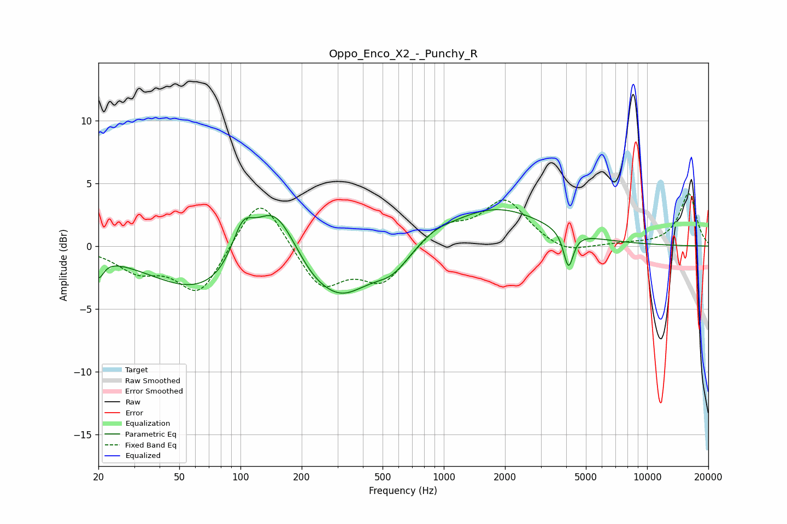

# Oppo_Enco_X2_-_Punchy_R
See [usage instructions](https://github.com/jaakkopasanen/AutoEq#usage) for more options and info.

### Parametric EQs
Apply preamp of -3.0 dB when using parametric equalizer.

|   # | Type    |   Fc (Hz) |    Q |   Gain (dB) |
|-----|---------|-----------|------|-------------|
|   1 | Peaking |        20 | 5.6  |        -1.6 |
|   2 | Peaking |        67 | 0.55 |        -3.9 |
|   3 | Peaking |       102 | 2.64 |         3   |
|   4 | Peaking |       146 | 1.3  |         5   |
|   5 | Peaking |       224 | 1.72 |        -0.8 |
|   6 | Peaking |       311 | 0.99 |        -3.7 |
|   7 | Peaking |       558 | 1.52 |        -1.7 |
|   8 | Peaking |       888 | 1.76 |         0.5 |
|   9 | Peaking |      1789 | 0.58 |         3.1 |
|  10 | Peaking |      4105 | 5.95 |        -2.9 |

### Fixed Band EQs
When using fixed band (also called graphic) equalizer, apply preamp of **-4.3 dB** (if available) and set gains manually with these parameters.

|   # | Type    |   Fc (Hz) |    Q |   Gain (dB) |
|-----|---------|-----------|------|-------------|
|   1 | Peaking |        31 | 1.41 |        -1.7 |
|   2 | Peaking |        62 | 1.41 |        -3.9 |
|   3 | Peaking |       125 | 1.41 |         4.5 |
|   4 | Peaking |       250 | 1.41 |        -3.4 |
|   5 | Peaking |       500 | 1.41 |        -2.8 |
|   6 | Peaking |      1000 | 1.41 |         1.7 |
|   7 | Peaking |      2000 | 1.41 |         3.6 |
|   8 | Peaking |      4000 | 1.41 |        -0.8 |
|   9 | Peaking |      8000 | 1.41 |         0.1 |
|  10 | Peaking |     16000 | 1.41 |         4.2 |

### Graphs

