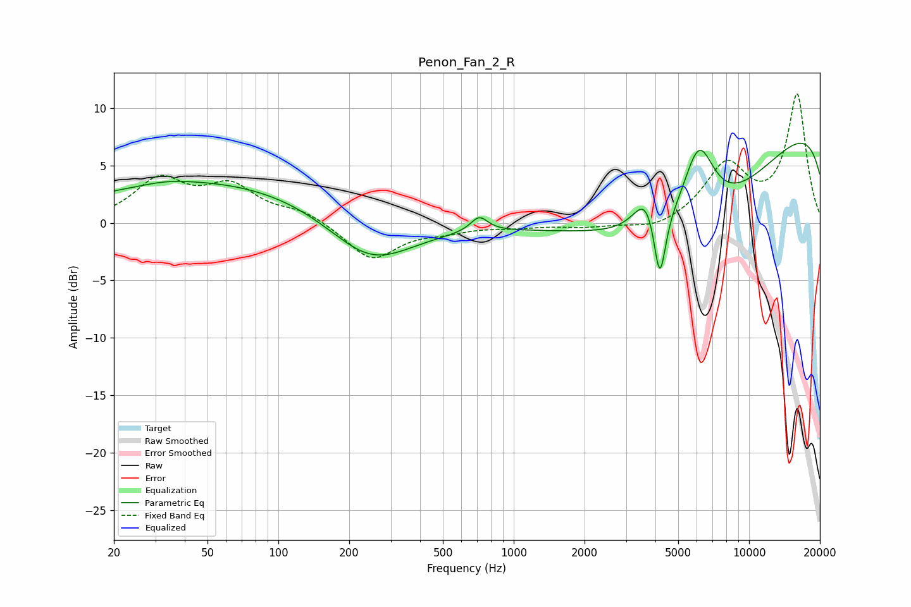

# Penon_Fan_2_R
See [usage instructions](https://github.com/jaakkopasanen/AutoEq#usage) for more options and info.

### Parametric EQs
Apply preamp of -7.0 dB when using parametric equalizer.

|   # | Type    |   Fc (Hz) |    Q |   Gain (dB) |
|-----|---------|-----------|------|-------------|
|   1 | Peaking |        20 | 0.2  |         1   |
|   2 | Peaking |        34 | 1.49 |         0.3 |
|   3 | Peaking |        66 | 0.27 |         2.9 |
|   4 | Peaking |       246 | 0.77 |        -4.4 |
|   5 | Peaking |       714 | 3.87 |         1.3 |
|   6 | Peaking |      3657 | 2.69 |         3.1 |
|   7 | Peaking |      4175 | 5.54 |        -6.3 |
|   8 | Peaking |      5881 | 0.31 |       -13.2 |
|   9 | Peaking |      6110 | 1.98 |         7   |
|  10 | Peaking |     10000 | 0.18 |        13.5 |

### Fixed Band EQs
When using fixed band (also called graphic) equalizer, apply preamp of **-11.3 dB** (if available) and set gains manually with these parameters.

|   # | Type    |   Fc (Hz) |    Q |   Gain (dB) |
|-----|---------|-----------|------|-------------|
|   1 | Peaking |        31 | 1.41 |         3.6 |
|   2 | Peaking |        62 | 1.41 |         2.9 |
|   3 | Peaking |       125 | 1.41 |         1   |
|   4 | Peaking |       250 | 1.41 |        -3.2 |
|   5 | Peaking |       500 | 1.41 |        -0.6 |
|   6 | Peaking |      1000 | 1.41 |        -0.3 |
|   7 | Peaking |      2000 | 1.41 |        -0.3 |
|   8 | Peaking |      4000 | 1.41 |        -0.7 |
|   9 | Peaking |      8000 | 1.41 |         4.9 |
|  10 | Peaking |     16000 | 1.41 |        11.1 |

### Graphs

