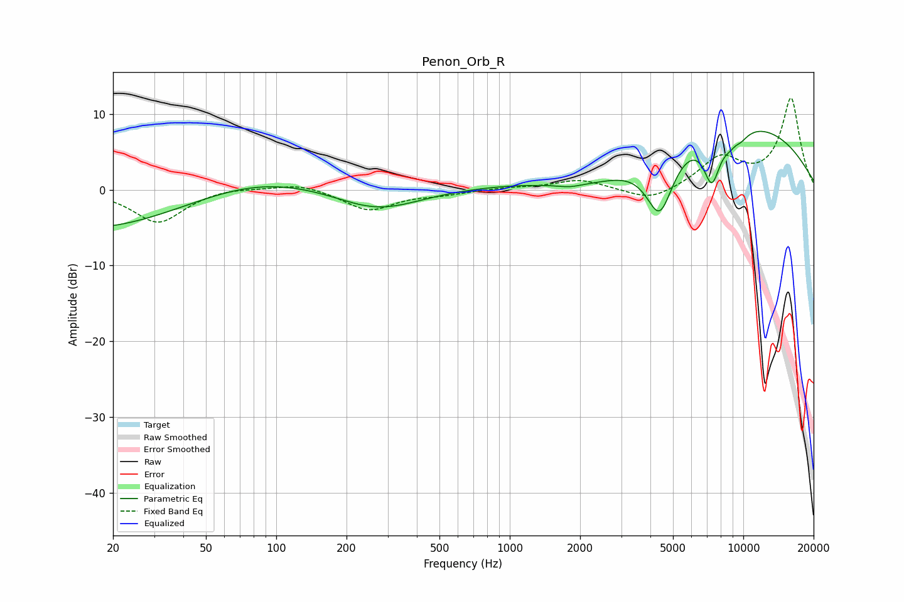

# Penon_Orb_R
See [usage instructions](https://github.com/jaakkopasanen/AutoEq#usage) for more options and info.

### Parametric EQs
Apply preamp of -7.8 dB when using parametric equalizer.

|   # | Type    |   Fc (Hz) |    Q |   Gain (dB) |
|-----|---------|-----------|------|-------------|
|   1 | Peaking |        47 | 0.18 |       -10.5 |
|   2 | Peaking |        84 | 0.31 |        10.7 |
|   3 | Peaking |       271 | 0.76 |        -3.1 |
|   4 | Peaking |      1804 | 2.96 |        -0.3 |
|   5 | Peaking |      2424 | 0.52 |        -6.2 |
|   6 | Peaking |      4388 | 2.25 |        -8.8 |
|   7 | Peaking |      6284 | 0.22 |        11.1 |
|   8 | Peaking |      7333 | 3.66 |        -6.4 |
|   9 | Peaking |      9222 | 3.06 |        -3.7 |
|  10 | Peaking |      9248 | 4.89 |         1.8 |

### Fixed Band EQs
When using fixed band (also called graphic) equalizer, apply preamp of **-12.2 dB** (if available) and set gains manually with these parameters.

|   # | Type    |   Fc (Hz) |    Q |   Gain (dB) |
|-----|---------|-----------|------|-------------|
|   1 | Peaking |        31 | 1.41 |        -4.4 |
|   2 | Peaking |        62 | 1.41 |         0.4 |
|   3 | Peaking |       125 | 1.41 |         0.9 |
|   4 | Peaking |       250 | 1.41 |        -2.7 |
|   5 | Peaking |       500 | 1.41 |        -0.5 |
|   6 | Peaking |      1000 | 1.41 |         0.3 |
|   7 | Peaking |      2000 | 1.41 |         1.3 |
|   8 | Peaking |      4000 | 1.41 |        -1.7 |
|   9 | Peaking |      8000 | 1.41 |         4   |
|  10 | Peaking |     16000 | 1.41 |        12   |

### Graphs

