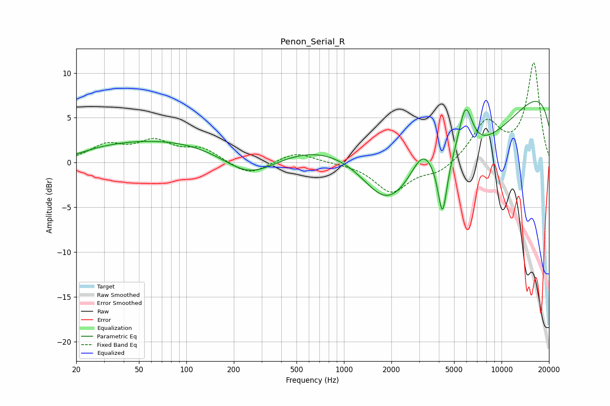

# Penon_Serial_R
See [usage instructions](https://github.com/jaakkopasanen/AutoEq#usage) for more options and info.

### Parametric EQs
Apply preamp of -6.9 dB when using parametric equalizer.

|   # | Type    |   Fc (Hz) |    Q |   Gain (dB) |
|-----|---------|-----------|------|-------------|
|   1 | Peaking |        20 | 1.86 |        -0.4 |
|   2 | Peaking |        77 | 0.26 |         2.7 |
|   3 | Peaking |       250 | 0.8  |        -3.2 |
|   4 | Peaking |      1055 | 0.39 |         3.4 |
|   5 | Peaking |      1849 | 0.92 |        -4.9 |
|   6 | Peaking |      3166 | 1.92 |         3.2 |
|   7 | Peaking |      4218 | 4.93 |        -6.3 |
|   8 | Peaking |      5206 | 0.27 |       -11.8 |
|   9 | Peaking |      5893 | 3    |         5.8 |
|  10 | Peaking |     10000 | 0.18 |        12.9 |

### Fixed Band EQs
When using fixed band (also called graphic) equalizer, apply preamp of **-11.2 dB** (if available) and set gains manually with these parameters.

|   # | Type    |   Fc (Hz) |    Q |   Gain (dB) |
|-----|---------|-----------|------|-------------|
|   1 | Peaking |        31 | 1.41 |         1.8 |
|   2 | Peaking |        62 | 1.41 |         2.1 |
|   3 | Peaking |       125 | 1.41 |         1.5 |
|   4 | Peaking |       250 | 1.41 |        -1.5 |
|   5 | Peaking |       500 | 1.41 |         1.2 |
|   6 | Peaking |      1000 | 1.41 |        -0   |
|   7 | Peaking |      2000 | 1.41 |        -3.3 |
|   8 | Peaking |      4000 | 1.41 |        -1.2 |
|   9 | Peaking |      8000 | 1.41 |         4.4 |
|  10 | Peaking |     16000 | 1.41 |        11   |

### Graphs

