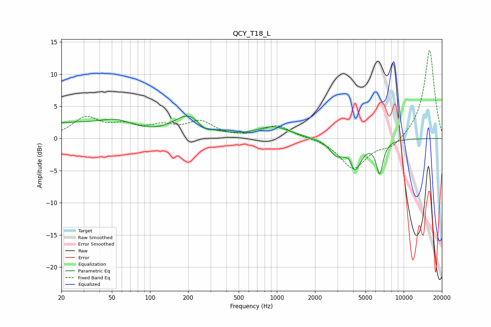

# QCY_T18_L
See [usage instructions](https://github.com/jaakkopasanen/AutoEq#usage) for more options and info.

### Parametric EQs
Apply preamp of -3.6 dB when using parametric equalizer.

|   # | Type    |   Fc (Hz) |    Q |   Gain (dB) |
|-----|---------|-----------|------|-------------|
|   1 | Peaking |        20 | 0.38 |         2.2 |
|   2 | Peaking |        55 | 1.09 |         1.5 |
|   3 | Peaking |       202 | 1.2  |         3.4 |
|   4 | Peaking |       263 | 2.92 |        -0.9 |
|   5 | Peaking |       944 | 1.12 |         1.8 |
|   6 | Peaking |      2920 | 2.81 |        -1.9 |
|   7 | Peaking |      3743 | 6    |         1.2 |
|   8 | Peaking |      4079 | 2.69 |        -4.9 |
|   9 | Peaking |      6401 | 5.98 |         1   |
|  10 | Peaking |      6450 | 5.13 |        -5.9 |

### Fixed Band EQs
When using fixed band (also called graphic) equalizer, apply preamp of **-13.8 dB** (if available) and set gains manually with these parameters.

|   # | Type    |   Fc (Hz) |    Q |   Gain (dB) |
|-----|---------|-----------|------|-------------|
|   1 | Peaking |        31 | 1.41 |         3.1 |
|   2 | Peaking |        62 | 1.41 |         1.7 |
|   3 | Peaking |       125 | 1.41 |         1.6 |
|   4 | Peaking |       250 | 1.41 |         2.4 |
|   5 | Peaking |       500 | 1.41 |        -0   |
|   6 | Peaking |      1000 | 1.41 |         2   |
|   7 | Peaking |      2000 | 1.41 |         0.1 |
|   8 | Peaking |      4000 | 1.41 |        -4.7 |
|   9 | Peaking |      8000 | 1.41 |        -1.5 |
|  10 | Peaking |     16000 | 1.41 |        13.9 |

### Graphs

